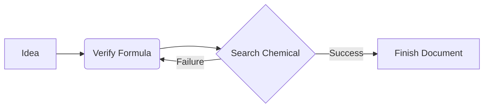

# 🧪 Joy Markdown Studio v3.9.1 🌟

> **The Ultimate Science & Engineering Research and Academic Markdown Editing & Visualization Studio**  
> A premium desktop markdown creator application crafted with Python (`PyWebView` + `Bottle`) and modern Vanilla CSS/JS.

---

## 📸 Overview
**Joy Markdown Studio** goes beyond a simple document viewer; it is an academic-friendly markdown editor designed to maximize productivity for researchers and students in science and engineering fields. It provides high-end features such as support for entering complex mathematical symbols, automatic 2D molecular structure generation via chemical name search, real-time diagram rendering (Mermaid), and standalone high-quality HTML export, all with a sleek Glassmorphism UI.

---

## ✨ Key Features

### 1. 📝 CodeMirror 6 Editor Core & Full Modularization
* **High-Speed Modern Editor Engine**: Replaced the standard textarea with the high-performance CodeMirror 6 engine. It provides a fast and stable typing environment even with massive markdown documents.
* **Maximizing Coding Productivity**: Packed with essential coding assists such as auto-close brackets, robust undo/redo history, and custom shortcuts found in modern editors.

### 2. 📐 Academic Math Helper (KaTeX Integration)
* **Real-time Formula Rendering**: Equipped with a fast and accurate KaTeX engine to render inline math (`$...$`) and block math (`$$...$$`) seamlessly.
* **KaTeX Math Input Helper & Preview Enhancements (v3.8.9 New)**: Upgraded the KaTeX library to version 0.17.0 globally, restored mathematical previews for previously non-rendering items (such as `\sout` strikeout, `\overbracket`, and `\underbracket`), added dedicated cards for actuarial angles (`\angl`, `\angln`), and fixed the layout overlap issue for `\mathclap` by enforcing limits rendering.
* **Electrical & Electronics (EE) Subtab Revamp (v3.8.8)**: Revamped the Electrical/Electronics subtab into 6 clear subdivisions (Basic Operators, Circuit Theory, Electromagnetics, Signals & Systems, Semiconductor Physics, Control Engineering) with 3-column unified grid, and fixed math preview tooltips by resolving LaTeX escaping.
* **Three Science & Engineering Tabbed Helper Panels**: 
  * **Math (📐)**: One-click insertion of fractions, roots, calculus, limits, Greek letters, and key symbols.
  * **Physics (⚛️)**: Provides essential formulas such as Coulomb's law, universal gravitation, Schrödinger's equation, Lorentz force, etc.
  * **Chemistry/Life Sciences (🧪)**: Supports templates for Arrhenius equation, ideal gas law, reaction arrows, DNA base pairs, and Gibbs free energy.
* **Smart Cursor and Wildcards**: When inserting a formula template, the area to be edited (`?`) is automatically focused as a mouse selection, minimizing typing movement.

### 3. 🧬 PubChem Real-time Chemical Molecular Structure Visualization
* **PubChem API Integration**: When searching for chemical compound names in Korean or English (e.g., `아스피린`, `caffeine`, `capsaicin`), it retrieves molecular data and SMILES strings in real time from the US National Library of Medicine (NLM) PubChem database.
* **2D Molecular Structure Preview**: Displays the 2D vector structural formula of the searched compound as real-time graphics inside the panel.
* **SMILES Code Drawer**: When inserted into the editor as a ````smiles ```` code block, it is automatically visualized as a beautiful chemical skeletal structure model in the main preview area.
* **Built-in Korean-English Mapping**: When searching for Korean compound names, it intelligently maps to the corresponding English term to query the API.

### 4. 📊 Dynamic Diagrams (Mermaid.js)
* Instantly visualizes flowcharts, sequence diagrams, Gantt charts, mind maps, etc., directly from markdown text code.
* **Mermaid Fullscreen & Zoom Mode**: Double-clicking a rendered diagram or clicking the icon opens it in a high-resolution fullscreen modal for detailed observation.

### 5. 🗂️ Smart & Safe Library File Management
* **Tree Explorer**: Displays the folder and file structure within the workspace in an elegant layout.
* **User Data Protection (Safe Unregister)**: Deleting a document does not delete the physical disk file; it only unregisters it from the library database (`md_viewer_config.json`), preventing accidental loss of research source code or documents.
* **Drag and Drop Support**: Dropping markdown files (`.md`, `.qmd`, `.txt`) from Windows Explorer onto the app screen loads them instantly with a visual guideline overlay.

### 6. 🚀 Modern Design & Responsive UI
* **Glassmorphism & Neon Themes**: Supports smooth transitions between dark mode (default) and light mode, with an eye-friendly color palette and accent glowing effects.
* **Sliding Hidden Panels**: Left explorer and right TOC (Table of Contents) panels slide cleanly to the screen edges, maximizing document writing space.
* **Synchronized Scroll**: Highly synchronizes the scroll positions of the editor and preview areas to assist in reviewing long documents.

### 7. 🌐 Standalone HTML Export
* Exports the editing markdown as a completely standalone HTML file for external sharing.
* The exported file preserves KaTeX equations, Prism syntax highlighting, Mermaid diagrams, and SMILES molecular models, rendering normally in any browser with an internet connection without needing a viewer.

### 8. 🖨️ Premium Driverless PDF Printing
* **Custom Print of Preview Screen Only**: Clicking the PDF print button automatically removes unnecessary editor text areas, sidebars, headers, and other UI elements, outputting **only the markdown preview output formatted cleanly for A4 size**.
* **Intelligent Ink Saving & Theme Switching**: Even if printing from dark mode, the document **temporarily auto-renders in a white/high-contrast theme for printing** to prevent wasting ink/toner and maximize readability, and returns to dark mode immediately after printing completes.

### 9. 🌐 External Mobile Device Connection & Security Password Protection
* **Mobile and Tablet Remote Connection**: Supports multi-networking so you can access the workspace from other PCs or mobile devices on the same Wi-Fi/network. Enter the **Network Access URL (e.g., `http://192.168.x.x:58220`)** shown in the console to view your library wirelessly.
* **Access Password Configuration**: You can set an access password via the **Settings icon (⚙️)** in the top right. When configured, a sleek and secure **Lock Screen** is activated for external network access.
* **Custom Port & Host Binding**: Easily change the binding host (IP: `0.0.0.0` or `127.0.0.1`) and web service port number from the settings modal, which is saved permanently.

### 10. 🌐 Bilingual UI Language Toggle
* **Real-time UI Translation**: Switch the entire application interface (sidebar tabs, header buttons, labels, placeholders, tooltips, and dialog alerts) between Korean and English instantly via the **KR/EN** toggle button in the header.
* **Settings Persistence**: The selected language is saved in real time to the local browser's `localStorage` and the `md_viewer_config.json` configuration file, automatically restoring the last state on startup.

### 11. ☁️ Bidirectional Real-time Google Drive Sync & Remote Browsing (v3.9.0 New)
* **Easy Cloud Connection**: Seamlessly connect to Google Drive using the dedicated 'Cloud Sync' accordion menu located right under your local file tree.
* **Zero-Configuration Browser Login**: Standard credentials are built directly into the compiled application. General users do not need to download or manually configure client_secrets.json files; clicking connect immediately opens their system web browser for OAuth.
* **App-Specific Scope for Safety**: Operates under the drive.file scope, meaning it can only see and manage files created by this application. Your other personal Google Drive folders remain completely isolated and secure.
* **Smart Syncing & Conflict Resolution**: Supports automatic background syncing on save as well as manual triggers. Detects local/remote modified time (mtime) differences and prompts an intelligent conflict resolution modal if a newer file exists on the cloud.
* **Remote File Browser & Import**: View markdown documents safely stored in your Google Drive cloud workspace. Import any file that is not yet locally registered with a single click.
* **Custom Credentials Override**: If you wish to use your own private GCP project keys, you can easily load your custom client_secrets.json file directly through the in-app setup guide dialog.

---

## 🛠️ System Architecture

Joy Markdown Studio adopts a powerful hybrid architecture combining a Python desktop shell and a modern web frontend.

```{mermaid}
graph TD
    subgraph backend ["Python Backend"]
        A[jmstudio.py Main Entry] --> B[PyWebView Shell]
        A --> C[Bottle Local Server]
        A --> D[Pillow Icon Builder]
    end
    
    subgraph frontend ["UI / Front-end (Local Server & API Bridge)"]
        B <-->|JS API Bridge| E[HTML/Vanilla CSS/JS Client]
        C -->|Serves Resources & Workspace Files| E
        E --> F[Marked.js Markdown Parser]
        E --> G[Prism.js Syntax Highlighter]
        E --> H[KaTeX Math Engine]
        E --> I[SmilesDrawer Molecular Graphics]
        E --> J[Mermaid.js Diagrammer]
    end
    
    subgraph cloud ["Cloud APIs"]
        E -->|GET API Request| K[PubChem PUG REST API]
    end
```

---

## 📂 Project Structure

```
e:\jm_studio\
├── jmstudio.py                  # Backward-compatible delegate main script (launches main.py)
├── main.py                      # Application entry point and GUI/WebView launcher
├── app_config.py                # Configuration loader/saver and global variables management
├── api_bridge.py                # Secure JavaScript-to-Python PyWebView API bridge
├── routes.py                    # Bottle-based local web server routing and static assets handler
├── compile.bat                  # Compiler script for Windows standalone executable (.exe)
├── compile.sh                   # Compiler script for macOS standalone app (.app)
├── git_push.bat                 # Script to push to GitHub remote repository (jmstudio)
├── .gitignore                   # Excludes build outputs, temporary cache, and config files from Git
├── md_viewer_config.json        # Database storing library files, recently opened file, theme, and settings
├── app_icon.png                 # Studio launcher logo image
├── app_icon.ico                 # Multi-size system tray and frame icon generated automatically
├── document.md                  # Temporary markdown storage sample
├── README.md                    # English help document (this file)
├── README_kr.md                 # Korean help document
├── setup.py                     # Python package configuration script for PyPI uploading
├── MANIFEST.in                  # Manifest file specifying static assets to include in PyPI package
├── frontend/                    # Frontend static web assets directory
│   ├── index.html               # Single Page Application (SPA) skeleton with modular script loader
│   └── static/                  # Static assets directory
│       ├── css/
│       │   └── style.css        # Vanilla CSS file containing glassmorphism design tokens & themes
│       └── js/
│           ├── translations.js  # Multilingual translations database (Korean / English)
│           └── editor.js        # CodeMirror 6 editor engine, KateX math, chemical drawer, diagrams, & window bindings
└── doc/                         # Academic and rendering guide documents folder (KR/EN)
    ├── chemical_formula_guide_kr.md        # Chemical formula (SMILES) rendering guide (Korean)
    ├── chemical_formula_guide_en.md        # Chemical formula (SMILES) rendering guide (English)
    ├── chemistry_encyclopedia_kr.md        # Chemical encyclopedia and SMILES database (Korean)
    ├── chemistry_encyclopedia_en.md        # Chemical encyclopedia and SMILES database (English)
    ├── computer_science_guide_kr.md        # Computer science diagram and math guide (Korean)
    ├── computer_science_guide_en.md        # Computer science diagram and math guide (English)
    ├── flowchart_guide_kr.md               # Flowchart and chart creation guide (Korean)
    ├── flowchart_guide_en.md               # Flowchart and chart creation guide (English)
    ├── geometry_guide_kr.md                # Geometry and physics diagram guide (Korean)
    ├── geometry_guide_en.md                # Geometry and physics diagram guide (English)
    ├── markdown_guide_kr.md                # Basic markdown syntax and style guide (Korean)
    ├── markdown_guide_en.md                # Basic markdown syntax and style guide (English)
    ├── math_science_guide_kr.md            # KaTeX math & science formula guide (Korean)
    ├── math_science_guide_en.md            # KaTeX math & science formula guide (English)
    ├── mermaid_guide_kr.md                 # Mermaid diagram visualization guide (Korean)
    └── mermaid_guide_en.md                 # Mermaid diagram visualization guide (English)
```

---

## 🆚 Why Joy Markdown Studio? (vs Obsidian)

While both **Joy Markdown Studio (JM-STUDIO)** and **Obsidian** are powerful local markdown editors, their core philosophy, target audience, and out-of-the-box features are distinctly different.

### 1. 🧪 Out-of-the-Box STEM Research Environment
* **Obsidian**: Focuses on general personal knowledge management (PKM) and Zettelkasten. To comfortably write complex equations or chemistry formulas, you have to find, install, and configure numerous community plugins.
* **JM-STUDIO**: A fully-equipped environment for mathematicians, physicists, and chemists is **built-in from the moment you install it**. Dedicated helper panels allow you to insert complex templates like limits, Lorentz force, and the Schrödinger equation with a single click.

### 2. 🧬 Real-time PubChem Molecule Visualization (Killer Feature)
* **Obsidian**: No native feature to search or render chemical molecular structures.
* **JM-STUDIO**: Natively integrated with the **NLM PubChem API**. Search for compounds (like "Aspirin" or "Caffeine") to view real-time 2D molecular structures, and automatically insert SMILES codes to render beautiful molecular graphics directly in your markdown document.

### 3. 🌐 Built-in Free Remote Web Access & Security
* **Obsidian**: Real-time sync and remote viewing require paid services (Obsidian Sync) or complex third-party cloud configurations.
* **JM-STUDIO**: Automatically spins up an internal web server. By entering the network URL (`http://192.168.x.x:58220`) into a browser on your tablet or smartphone on the same Wi-Fi, you get **instant remote access to your library**. It even supports a custom Lock Screen password for perfect security.

### 4. 🎨 Premium Glassmorphism UI
* **Obsidian**: The default UI is utilitarian and requires manual CSS theme tweaking to look modern.
* **JM-STUDIO**: Features a stunning, translucent glassmorphism interface and smooth micro-animations right out of the box, providing visual delight and a premium experience while you research.

### 5. 🖨️ Intelligent PDF Printing & Standalone HTML Export
* **Obsidian**: Printing PDFs with dark themes can be cumbersome and wastes ink.
* **JM-STUDIO**: When printing from Dark Mode, JM-STUDIO intelligently **auto-renders a high-contrast white theme in 0.1 seconds** just for the PDF export to save ink and maximize readability, instantly reverting to Dark Mode afterward. It also supports zero-dependency Standalone HTML exports, allowing you to share a single file with colleagues that looks identical to the app.

### 6. ☁️ One-Click Bidirectional Google Drive Sync
* **Obsidian**: Requires a paid subscription (Obsidian Sync, $8–$10/month) for real-time cloud sync, or complex configurations with community plugins (like Remotely Save) and third-party cloud accounts.
* **JM-STUDIO**: Includes a **built-in Google Drive sync engine** out of the box. Users can connect to Google Drive with a single click via OAuth login. It supports automatic sync on save, modification time (mtime) conflict resolution, and remote cloud library browsing to download and import notes onto a new machine instantly.

> **💡 In Summary:**
> If Obsidian is a "universal diary where you build your own notes using Lego blocks," **Joy Markdown Studio is a "fully-loaded premium research studio designed so scientists and researchers can dive straight into their work with zero setup!"**

## 🚀 Getting Started

### 📋 Prerequisites
To run this application or build standalone packages, the following environment is recommended:
* **Python**: Python 3.10 or higher (The Windows build script automatically detects `C:\Python\Python313\python.exe` and `python` in system PATH.)
* **Dependency Libraries**:
  * `pywebview`: Creating desktop app GUI frame window
  * `bottle`: Operating local lightweight web server and routing resources
  * `Pillow` (PIL): Automatic conversion of PNG app icon to multi-resolution Windows `.ico` format
  * `pyinstaller`: Standalone execution bundle compilation (required for building)

### 💻 Installation & Run

#### Option 1: Official Installation via PyPI (Highly Recommended)
If you have a Python environment, you can install, run, upgrade, and uninstall the app from anywhere in the world with a single command.

##### Windows & macOS & Linux Combined Commands

| Action | Command |
| :--- | :--- |
| **Install** | `pip install joy-markdown-studio` |
| **Run** | `jmstudio` |
| **Upgrade** | `pip install --upgrade joy-markdown-studio` |
| **Uninstall** | `pip uninstall joy-markdown-studio` |

> [!TIP]
> **OS Specific Reference**
> - **Windows**: Open PowerShell or CMD and type the commands to run immediately.
> - **macOS**: Can be run from the default Terminal. Depending on your environment, you may need to use `pip3` and `python3` instead.
> - **Linux (Ubuntu/Debian, etc.)**: 
>   - On Linux desktop environments, some system dependency packages are required for GUI rendering. We highly recommend installing them first using:
>     ```bash
>     sudo apt-get update
>     sudo apt-get install python3-pip python3-pywebview libgtk-3-dev libwebkit2gtk-4.0-dev
>     ```

#### Option 2: Global System Environment Source Code Run
1. **Install required libraries**:
   ```bash
   pip install pywebview bottle Pillow
   # For building the executable
   pip install pyinstaller
   ```

2. **Run application**:
   ```bash
   python jmstudio.py
   ```

#### Option 2: Using Virtual Environment (venv) (Recommended)
Using a local virtual environment prevents system environment clutter and ensures clean building when using `compile.bat`/`compile.sh` scripts.

1. **Create and activate virtual environment**:
   * **Windows (PowerShell)**:
     ```powershell
     python -m venv .venv
     .venv\Scripts\activate
     ```
   * **macOS / Linux (Terminal)**:
     ```bash
     python3 -m venv .venv
     source .venv/bin/activate
     ```

2. **Install dependencies and run**:
   ```bash
   pip install --upgrade pip
   pip install pywebview bottle Pillow pyinstaller
   python jmstudio.py
   ```
   * *Note: If `app_icon.png` exists in the project root on startup, `app_icon.ico` is automatically generated.*

### 📦 Distributing as Standalone Executable
You can compile **Joy Markdown Studio** into a standalone executable that runs on other PCs without requiring Python or other libraries.

> [!TIP]
> **Virtual Environment (.venv) Auto-Detection**
> * If a `.venv` virtual environment folder exists in the project root, the build scripts automatically prioritize using Python within the virtual environment (`.venv/Scripts/python.exe` or `.venv/bin/python`) over global system Python.
> * This ensures clean builds isolating all required dependencies.

#### 🪟 Building on Windows (.exe)
1. **Run one-click compile script**:
   * Double-click [compile.bat](file:///e:/jm_studio/compile.bat) or run the following in your shell:
     * **PowerShell (Default)**:
       ```powershell
       .\compile.bat
       ```
     * **Command Prompt (CMD)**:
       ```cmd
       compile.bat
       ```
   * The script auto-installs/upgrades `PyInstaller` within your environment and bundles `jmstudio.py` into a single versioned EXE file (`dist\JoyMarkdownStudio-vX.XX.exe`).

2. **Copy and Distribute**:
   * Copy the **`JoyMarkdownStudio-vX.XX.exe`** from the `dist/` directory. No other files are needed.
   * *Note: As the dependencies are compressed inside the executable, first launch may take 3-5 seconds to decompress.*

#### 🍎 Building on macOS (.app)
> [!IMPORTANT]
> PyInstaller does not support cross-compilation. You **must build on a macOS computer** to compile macOS applications.

1. **Run compile script in macOS Terminal**:
   * Copy the source folder to a Mac, open the terminal, navigate to the folder, and run:
     ```bash
     chmod +x compile.sh
     ./compile.sh
     ```
   * The script generates the standalone app bundle **`JoyMarkdownStudio-vX.XX.app`** inside the `dist/` folder.

2. **Distribute**:
   * Compress `JoyMarkdownStudio-vX.XX.app` into a Zip file for distribution.
   * *Note: Since the app is not signed with an Apple Developer account, first-time users must **Right-click -> Open** and click Open to bypass the Gatekeeper security warning.*

---

## 💡 Practical Markdown Tips

### 🧪 1. Drawing Chemical Formulas
Set code block language to `smiles` and write a SMILES molecular string:
```markdown
```smiles
OC(=O)/C=C/c1ccc(O)c(O)c1
```
```
*This renders as a beautiful **Caffeic acid** molecular structure in the preview.*

### 📐 2. Entering Equations
Write block equations using `$$` or inline equations using `$`, or click helper buttons on the left panel:
```markdown
Mass and energy are equivalent and represented by: $E = mc^2$

$$i\hbar\frac{\partial}{\partial t}\Psi = \hat{H}\Psi$$
```

### 📊 3. Inserting Diagrams
Renders flowcharts or diagrams from text using `mermaid`:
```markdown

```

---

## ⚙️ Configuration

Settings are permanently preserved inside `md_viewer_config.json` generated in the application folder:
```json
{
    "theme": "dark",
    "last_file": "doc/markdown_guide_kr.md",
    "last_workspace": "e:\\jm_studio",
    "port": 58220,
    "bind_ip": "0.0.0.0",
    "access_password": "your_secure_password",
    "added_documents": [
        "doc/chemical_formula_guide_kr.md",
        "doc/chemistry_encyclopedia_kr.md",
        "document.md",
        "doc/flowchart_guide_kr.md",
        "doc/markdown_guide_kr.md",
        "doc/math_science_guide_kr.md",
        "doc/mermaid_guide_kr.md"
    ]
}
```
* **theme**: `dark` or `light`
* **last_file**: File path of the last working markdown document (restored automatically)
* **last_workspace**: Path of the active library directory loaded on startup
* **port**: Access web service port number (default: `58220`)
* **bind_ip**: Host binding address (`0.0.0.0`: allow all external access, `127.0.0.1`: allow local only)
* **access_password**: Security login password required for external web browsers (leave blank for no login)
* **added_documents**: Database list of documents registered in the user's library

---

## 🔒 Security & Optimization
* **Security Path Checks**: The `serve_workspace_file` router has strict path validation checks to completely prevent Directory Traversal attacks attempting to access files outside the active workspace.
* **Debounced Live Rendering**: To prevent interface lagging from continuous parsing of Mermaid and KaTeX while typing, a smart debounce timer is applied to ensure a highly responsive editing experience.

---
Start a smart and smooth research and documentation journey with **Joy Markdown Studio**! 🚀
