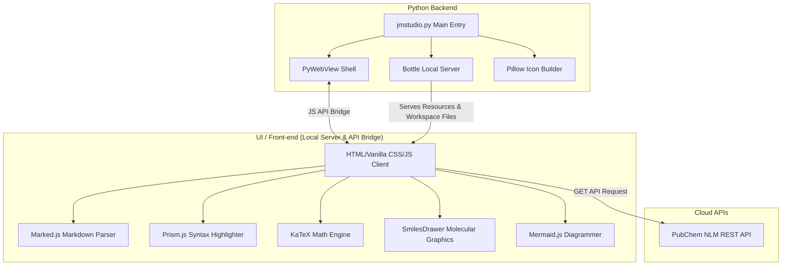

# 🧪 Joy Markdown Studio v3.9.26 🌟

> **The Ultimate Science & Engineering Research and Academic Markdown Editing & Visualization Studio**  
> A premium desktop markdown creator application crafted with Python (`PyWebView` + `Bottle`) and modern Vanilla CSS/JS.

> [!TIP]
> **💡 You can view the detailed release notes and updates history for all versions in the [CHANGELOG.md](file:///e:/jm_studio/CHANGELOG.md) document.**

---

## 📸 Overview
**Joy Markdown Studio** goes beyond a simple document viewer; it is an academic-friendly markdown editor designed to maximize productivity for researchers and students in science and engineering fields. It provides high-end features such as support for entering complex mathematical symbols, automatic 2D molecular structure generation via chemical name search, real-time diagram rendering (Mermaid), and standalone high-quality HTML export, all with a sleek Glassmorphism UI.

---

## ✨ Key Features

### 1. 📝 CodeMirror 6 Editor Core
* **High-Speed Modern Editor Engine**: Replaced the standard textarea with the high-performance CodeMirror 6 engine. It provides a fast and stable typing environment even with massive markdown documents.
* **Maximizing Coding Productivity**: Packed with essential coding assists such as auto-close brackets, robust undo/redo history, and custom shortcuts found in modern editors.

### 2. 📐 Academic Math Helper (KaTeX Integration)
* **Real-time Formula Rendering**: Equipped with a fast and accurate KaTeX engine to render inline math (`$...$`) and block math (`$$...$$`) seamlessly.
* **Three Science & Engineering Tabbed Helper Panels**: 
  * **Math (📐)**: One-click insertion of fractions, roots, calculus, limits, Greek letters, and key symbols.
  * **Physics (⚛️)**: Provides essential formulas such as Coulomb's law, universal gravitation, Schrödinger's equation, Lorentz force, etc.
  * **Chemistry/Life Sciences (🧪)**: Supports templates for Arrhenius equation, ideal gas law, reaction arrows, DNA base pairs, and Gibbs free energy.
* **Smart Cursor and Wildcards**: When inserting a formula template, the area to be edited (`?`) is automatically focused as a mouse selection, minimizing typing movement.

### 3. 🧬 PubChem Real-time Chemical Molecular Structure Visualization
* **PubChem API Integration**: Search for chemical compound names in Korean or English (e.g., `aspirin`, `caffeine`) to retrieve molecular data and SMILES strings in real time from the US NLM PubChem database.
* **2D Molecular Structure Preview**: Displays the 2D vector structural formula of the searched compound as real-time graphics inside the panel.
* **SMILES Code Drawer**: When inserted into the editor as a ````smiles ```` code block, it is automatically visualized as a beautiful chemical skeletal structure model in the main preview area.

### 4. 📊 Dynamic Diagrams (Mermaid.js)
* Instantly visualizes flowcharts, sequence diagrams, Gantt charts, mind maps, etc., directly from markdown text code.
* **Mermaid Fullscreen & Zoom Mode**: Double-clicking a rendered diagram or clicking the zoom icon opens it in a high-resolution fullscreen modal for detailed observation.

### 5. 🗂️ Smart & Safe Library File Management
* **Tree Explorer**: Displays the folder and file structure within the workspace in an elegant layout.
* **User Data Protection**: Deleting a document does not delete the physical disk file; it only unregisters it from the library database (`md_viewer_config.json`), preventing accidental loss of research source code or documents.
* **Drag and Drop Support**: Dropping markdown files (`.md`, `.qmd`, `.txt`) from Windows Explorer onto the app screen loads them instantly.

### 6. 🚀 Modern Design & Responsive UI
* **Glassmorphism & Neon Themes**: Supports smooth transitions between dark mode (default) and light mode, with an eye-friendly color palette and accent glowing effects.
* **Sliding Hidden Panels**: Left explorer and right TOC (Table of Contents) panels slide cleanly to the screen edges, maximizing document writing space.
* **Synchronized Scroll**: Highly synchronizes the scroll positions of the editor and preview areas to assist in reviewing long documents.

### 7. 🌐 Standalone HTML Export
* Exports the editing markdown as a completely standalone HTML file for external sharing.
* The exported file preserves KaTeX equations, Prism syntax highlighting, Mermaid diagrams, and SMILES molecular models, rendering normally in any browser with an internet connection.

### 8. 🖨️ Premium Driverless PDF Printing & Static Page Engine
* **Custom Print of Preview Screen Only**: Clicking the PDF print button automatically removes unnecessary editor text areas, sidebars, headers, and other UI elements, outputting only the markdown preview output formatted cleanly for A4 size.
* **Intelligent Ink Saving & Theme Switching**: Even if printing from dark mode, the document temporarily auto-renders in a white/high-contrast theme for printing to prevent wasting ink/toner, and returns to dark mode immediately after printing completes.
* **Precise A4 Margin Separation**: Discarded negative margins entirely. Placed headers fixed at `top: 0` and footers at `bottom: 0`, and dynamically calculated and applied precise safe body padding (`bodyPaddingTopBottom`) to ensure perfect vertical isolation with accurate static page numbers (**`1 / 2`**, **`2 / 2`**).

### 9. 🌐 External Mobile Device Connection & Security Password Protection
* **Mobile and Tablet Remote Connection**: Supports multi-networking so you can access the workspace from other PCs or mobile devices on the same Wi-Fi/network wirelessly.
* **Access Password Configuration**: Set an access password via the Settings icon (⚙️). When configured, a sleek and secure Lock Screen is activated for external network access.

### 10. ☁️ One-Click Bidirectional Google Drive Sync
* **Zero-Configuration OAuth Login**: Standard credentials are built directly into the compiled application. General users do not need to download or manually configure client_secrets.json files.
* **App-Specific Scope for Safety**: Operates under the drive.file scope, meaning it can only see and manage files created by this application.
* **Smart Syncing & Conflict Resolution**: Supports automatic background syncing on save, modification time (mtime) conflict resolution, and remote cloud library browsing to download and import notes instantly.

### 11. 🔗 Bi-directional Wiki Links & Backlinks Panel
* **Zettelkasten-Style Knowledge Connection**: Interconnects notes and documents to build a cohesive visual knowledge web, integrating raw daily ideas and research insights.
* **Real-time Wiki Link Widget**: Typing `[[WikiName]]` (or `[[WikiName|Alt Text]]`) automatically renders a clickable, beautiful purple neon button widget inside non-active editor lines. Clicking a button opens the document instantly if it exists, or auto-creates a new markdown file under the workspace root if it does not.
* **Dual Backlinks Navigators**:
  * **Left Sidebar**: Injects a Backlinks accordion panel below the file tree, displaying all incoming references mentioning the current note.
  * **Right Preview Panel**: Injects a premium card grid (`.backlink-card`) at the very bottom of the document preview for relational navigation.

### 🕸️ 12. Knowledge Graph & Category-based Node Icons
* **Interactive 2D Force Graph**: Renders bi-directional link relationships as a real-time 2D Force-Directed Graph, enabling dynamic exploration of your interconnected knowledge structure.
* **Category Emoji Mapping**: Analyzes tag metadata, file names, and directory paths to automatically classify documents into 11 categories (Academic, Chemistry, Stock, Project, Diary, Schedule, Wiki, etc.) and paints dedicated emoji icons inside each node.
* **Glassmorphic Neon Rings**: Envelops each node with a semi-transparent circular backdrop and an elegant glowing neon ring for outstanding aesthetic resolution.
* **Smart Camera Zoom Scaling**: Maintains clean geometry and precise scaling ratios between node boundaries and centered emoji glyphs at any 2D canvas zoom-in/out level.

### 13. 🎨 Obsidian-Compatible Infinite Canvas & Folder Embedding
* **Infinite 2D Canvas Board**: Provides D3-Zoom-based panning and pinch-to-zoom controls alongside a modern 16px neon grid background.
* **Bezier Edge Connections (SVG Edge)**: Draw smooth bezier curves between nodes. Click edge lines (28px click detection radius) to highlight, change HSL-based colors (6 options), or delete via a floating toolbar.
* **Smart Folder Embedding Cards**: Embed an entire local directory inside your canvas workspace. Supports Grid/List layout toggle, real-time file name filtering, sorting, parent-directory navigation, and instant file creation (`+`) directly inside the card.
* **Dedicated Card Nodes**: Freely position markdown files (with cached rendering), images, or PDF preview iframe nodes. Instantly mount CodeMirror 6 in-place editor widgets to modify embedded markdown files.
* **Native Mouse Interactions**: Matches standard desktop cursor styling using a default arrow (`default`) on the canvas board and a move cursor (`move`) during card dragging.
* **Canvas-specific Keyboard Shortcuts**:
  * `Ctrl + S`: Instant canvas saving
  * `Ctrl + Z`: Infinite Undo
  * `Ctrl + Y`: Infinite Redo
  * `Right-Click` (on cards): In-place settings and node options menu

---

## 🛠️ System Architecture

Joy Markdown Studio adopts a powerful hybrid architecture combining a Python desktop shell and a modern web frontend.



---

## 📂 Project Structure

```
e:\jm_studio\
├── jmstudio.py                  # Backward-compatible delegate main script (launches main.py)
├── main.py                      # Application entry point and GUI/WebView launcher
├── app_config.py                # Configuration loader/saver and global variables management
├── api_bridge.py                # Secure JavaScript-to-Python PyWebView API bridge
├── routes.py                    # Bottle-based local web server routing and static assets handler
├── compile.bat                  # Compiler script for Windows standalone executable (.exe)
├── compile.sh                   # Compiler script for macOS standalone app (.app)
├── git_push.bat                 # Script to push to GitHub remote repository (jmstudio)
├── .gitignore                   # Excludes build outputs, temporary cache, and config files from Git
├── md_viewer_config.json        # Database storing library files, recently opened file, theme, and settings
├── CHANGELOG.md                 # [NEW] English detailed release history and release notes
├── CHANGELOG_kr.md              # [NEW] Korean detailed release history and release notes
├── app_icon.png                 # Studio launcher logo image
├── app_icon.ico                 # Multi-size system tray and frame icon generated automatically
├── document.md                  # Temporary markdown storage sample
├── README.md                    # English help document (this file)
├── README_kr.md                 # Korean help document
├── setup.py                     # Python package configuration script for PyPI uploading
├── MANIFEST.in                  # Manifest file specifying static assets to include in PyPI package
└── frontend/                    # Frontend static web assets directory
```

---

## 🆚 Why Joy Markdown Studio? (vs Obsidian)

Joy Markdown Studio (JM-STUDIO) and Obsidian are both powerful local markdown editors, but their core philosophy, target audience, and out-of-the-box features are distinctly different.

### 1. 🧪 Out-of-the-Box STEM Research Environment
* **Obsidian**: Focuses on general personal knowledge management (PKM). To write equations or chemistry formulas, you must manually install numerous community plugins.
* **JM-STUDIO**: A fully-equipped environment for mathematicians, physicists, and chemists is built-in out-of-the-box. Dedicated helper panels allow you to insert complex equations with a single click.

### 2. 🧬 Real-time PubChem Molecule Visualization
* **Obsidian**: No native feature to search or render chemical molecular structures.
* **JM-STUDIO**: Natively integrated with the NLM PubChem API. Search for compounds to view real-time 2D molecular structures, and automatically insert SMILES codes.

### 3. 🌐 Built-in Free Remote Web Access & Security
* **Obsidian**: Real-time sync and remote viewing require paid services or complex third-party configurations.
* **JM-STUDIO**: Automatically spins up an internal web server. Access your library wirelessly from tablets or phones, secured with a custom lock screen password.

### 🕸️ 4. Category-based Node Icons in Knowledge Graph
* **Obsidian**: Node representations in the graph view are limited to uniform circular dots. Users must hover or click each node to identify its character or category.
* **JM-STUDIO**: Natively embeds intuitive emoji icons (📐, ⚛️, 🧪, 📈, 🗓️, etc.) inside the center of each document node, styled with glowing glassmorphic neon rings, providing unmatched visual clarity and aesthetic satisfaction during network exploration.

> **💡 In Summary:**
> If Obsidian is a "universal diary where you build your own notes using Lego blocks," **Joy Markdown Studio is a "fully-loaded premium research studio designed so scientists and researchers can dive straight into their work and interact visually with their knowledge web with zero setup!"**

---

## 🚀 Getting Started

### 📋 Prerequisites
To run this application or build standalone packages, the following environment is recommended:
* **Python**: Python 3.10 or higher
* **Dependency Libraries**: `pywebview`, `bottle`, `Pillow`, `pyinstaller`

### 💻 Installation & Run

#### Option 1: Official Installation via PyPI (Highly Recommended)
If you have a Python environment, you can install, run, upgrade, and uninstall the app with a single command.

| Action | Command |
| :--- | :--- |
| **Install** | `pip install joy-markdown-studio` |
| **Run** | `jmstudio` |
| **Upgrade** | `pip install --upgrade joy-markdown-studio` |
| **Uninstall** | `pip uninstall joy-markdown-studio` |

#### Option 2: Using Virtual Environment (venv) (Recommended)
Using a local virtual environment prevents system environment clutter.

1. **Create and activate virtual environment**:
   * **Windows (PowerShell)**:
     ```powershell
     python -m venv .venv
     .venv\Scripts\activate
     ```
2. **Install dependencies and run**:
   ```bash
   pip install --upgrade pip
   pip install pywebview bottle Pillow pyinstaller
   python jmstudio.py
   ```

### 📦 Distributing as Standalone Executable
You can compile Joy Markdown Studio into a standalone executable (.exe) that runs on other PCs.

#### 🪟 Building on Windows (.exe)
1. **Run compile script**:
   * Run the compile script in your shell:
     ```powershell
     .\compile.bat
     ```
   * The script packages `jmstudio.py` into a single EXE file inside the `dist/` directory.

---

## 💡 Practical Markdown Tips

### 🧪 1. Drawing Chemical Formulas
Set code block language to `smiles` and write a SMILES molecular string:
```markdown
```smiles
OC(=O)/C=C/c1ccc(O)c(O)c1
```
```

### 📐 2. Entering Equations
Write block equations using `$$` or inline equations using `$`:
```markdown
Mass and energy are equivalent and represented by: $E = mc^2$

$$i\hbar\frac{\partial}{\partial t}\Psi = \hat{H}\Psi$$
```

---

## ⚙️ Configuration
Settings are permanently preserved inside `md_viewer_config.json` generated in the application folder:
* **theme**: `dark` or `light`
* **last_file**: File path of the last working markdown document (restored automatically)
* **last_workspace**: Path of the active library directory loaded on startup
* **port**: Access web service port number (default: `58220`)
* **bind_ip**: Host binding address (`0.0.0.0`: allow all, `127.0.0.1`: allow local only)

---

## 🔒 Security & Optimization
* **Security Path Checks**: Strict path validation checks completely prevent Directory Traversal attacks.
* **Debounced Live Rendering**: Applies a smart debounce timer to ensure a highly responsive editing experience.

---
Start a smart and smooth research and documentation journey with **Joy Markdown Studio**! 🚀
