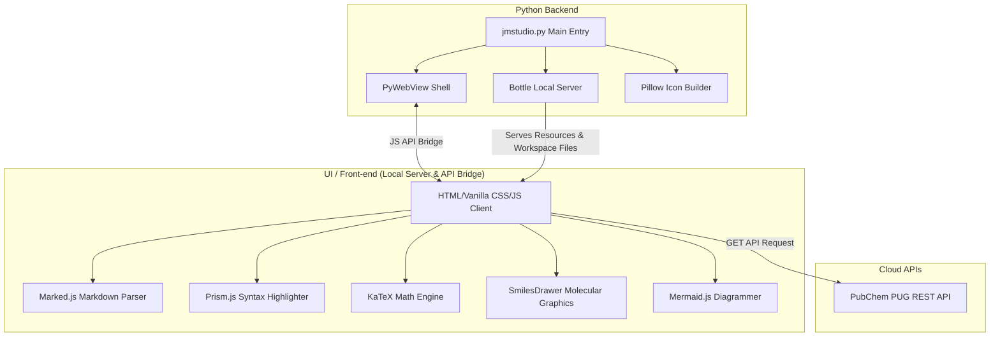

# 🧪 Joy Markdown Studio v3.9.26 🌟

> **수학, 물리학, 화학을 아우르는 최상의 이공계 연구 및 학술용 마크다운 편집·시각화 스튜디오**  
> Python (`PyWebView` + `Bottle`)과 모던 Vanilla CSS/JS로 직조된 프리미엄 데스크톱 마크다운 크리에이터 앱입니다.

> [!TIP]
> **💡 버전별 상세 업데이트 히스토리 및 기술 릴리즈 노트는 [CHANGELOG_kr.md](file:///e:/jm_studio/CHANGELOG_kr.md) 문서에서 정밀하게 확인하실 수 있습니다.**

---

## 📸 Overview
**Joy Markdown Studio**는 단순한 문서 뷰어를 넘어, 이공계 연구자 및 학생들의 생산성을 극대화하기 위해 설계된 학술 친화형 마크다운 편집기입니다. 복잡한 수식 기호 입력 지원, 화학명 검색을 통한 2D 분자 구조식 자동 생성, 실시간 다이어그램(Mermaid) 렌더링, 독립형 고품격 HTML 내보내기 등 최상급 기능을 유려한 글래스모피즘(Glassmorphism) UI와 함께 제공합니다.

---

## ✨ Key Features (핵심 기능)

### 1. 📝 CodeMirror 6 에디터 코어 고도화
* **초고속 모던 에디터 엔진**: 강력한 성능의 CodeMirror 6 엔진을 도입하여 방대한 마크다운 문서에서도 빠르고 안정적인 타이핑 환경을 제공합니다.
* **코딩 생산성 극대화**: 자동 괄호 닫기, 히스토리 지원(Undo/Redo), 멀티 커서 제공 등 모던 에디터에 필수적인 강력한 코딩 보조 기능들이 탑재되었습니다.

### 2. 📐 이공계 전용 학술 수식 도우미 (KaTeX)
* **실시간 수식 렌더링**: 빠르고 정확한 KaTeX 엔진을 탑재하여 인라인 수식(`$...$`)과 블록 수식(`$$...$$`)을 끊김 없이 실시간 렌더링합니다.
* **3대 이공계 탭형 도우미 패널**: 
  * **수학(📐)**: 분수, 루트, 미적분, 극한, 그리스 문자, 주요 기호 원클릭 삽입.
  * **물리(⚛️)**: 쿨롱 법칙, 만유인력, 슈뢰딩거 방정식, 로런츠 힘 등 필수 공식 제공.
  * **화학/생명(🧪)**: 아레니우스 식, 이상기체 상태방정식, 반응 화살표, DNA 염기쌍 등 템플릿 지원.
* **스마트 와일드카드 자동 포커스**: 수식 템플릿 삽입 시 편집할 부분(`?`)을 마우스 드래그 상태로 자동 포커싱하여 타이핑 동선을 최소화합니다.

### 3. 🧬 PubChem 실시간 화학 분자 구조식 시각화
* **PubChem API 연동**: 한글 및 영어 화합물 이름(예: `아스피린`, `caffeine`) 검색 시 미국 NLM PubChem 데이터베이스에서 실시간으로 분자 데이터 및 SMILES 코드를 가져옵니다.
* **2D 분자 구조 프리뷰**: 검색된 화합물의 2D 벡터 구조식을 패널 내부에서 실시간 그래픽으로 보여줍니다.
* **Smiles 코드 드로어**: 에디터에 ````smiles ```` 코드 블록으로 삽입 시, 메인 프리뷰 영역에서 자동으로 아름다운 화학 골격 모형 구조로 시각화합니다.

### 📊 4. 다이내믹 다이어그램 (Mermaid.js)
* 플로우차트, 시퀀스 다이어그램, 간트 차트, 마인드맵 등을 마크다운 텍스트 코드로 즉시 시각화합니다.
* **Mermaid 전체 화면 및 줌 모드**: 렌더링된 다이어그램을 더블 클릭하거나 돋보기 아이콘을 눌러 고해상도 전체 화면 모달로 띄워 정밀 관측할 수 있습니다.

### 🗂️ 5. 똑똑하고 안전한 서재(Library) 파일 관리
* **트리형 탐색기**: 워크스페이스 내 폴더 및 파일 구조를 미려하고 직관적인 디자인으로 보여줍니다.
* **사용자 데이터 보호**: 문서 삭제 시 물리적인 디스크 파일을 영구 삭제하지 않고, 서재 DB(`md_viewer_config.json`)에서만 안전하게 제외하여 연구 자산 및 소스코드 유실을 원천 차단합니다.
* **드래그 앤 드롭 지원**: 외부 마크다운 파일(`.md`, `.qmd`, `.txt`)을 앱 화면에 드롭하면 즉시 불러옵니다.

### 🚀 6. 모던 디자인 & 반응형 UI
* **글래스모피즘 & 네온 테마**: 다크 모드(기본)와 라이트 모드 간의 부드러운 전환을 지원하며, 눈이 편안한 색상 팔레트와 악센트 발광 효과를 적용했습니다.
* **슬라이딩 숨김 패널**: 좌측 익스플로러와 우측 TOC(목차) 패널을 화면 가장자리로 깔끔하게 슬라이딩 접기/펴기 할 수 있어 문서 작성 공간을 극대화합니다.
* **동기화 스크롤**: 에디터 영역과 미리보기 영역의 스크롤 위치를 고도로 동기화하여 검토 동선이 한결 매끄럽습니다.

### 🌐 7. 독립형 Standalone HTML 익스포트
* 편집 중인 마크다운을 외부나 웹에 즉시 공유할 수 있도록 완벽한 단독 실행형 HTML로 내보냅니다.
* 내보낸 파일은 인터넷 연결만 있으면 별도의 뷰어 없이도 KaTeX 수식, Prism 구문 강조, Mermaid 다이어그램, Smiles 분자 모델이 미려하게 보존되어 정상 작동합니다.

### 🖨️ 8. 프리미엄 무설치 PDF 인쇄 및 정적 페이지 엔진 탑재
* **미리보기 화면만 맞춤 인쇄**: 불필요한 에디터 영역과 사이드바 등의 UI를 제외하고 오직 실시간 미리보기 화면의 아름다운 마크다운 결과물만 A4 규격에 맞추어 출력합니다.
* **지능적 잉크 절약 및 테마 전환**: 다크 모드 상태에서 인쇄를 진행하더라도, 잉크/토너 낭비를 방지하고 종이에서의 가독성을 극대화하기 위해 **일시적으로 고대비 화이트 테마로 자동 리렌더링되어 출력**되며 완료 시 즉각 원래의 테마로 복원됩니다.
* **정밀 A4 여백 격리**: 음수 마진 방식을 전면 폐기하고, 기하학적 패딩 격리(`bodyPaddingTopBottom`) 및 자바스크립트 기반 동적 정적 페이지 분할 엔진을 도입하여 본문 겹침을 방지하고 정확한 정적 페이지 번호(**`1 / 2`**, **`2 / 2`**)를 매끄럽게 인쇄합니다.

### 🌐 9. 외부 모바일 기기 접속 및 보안 암호 보호
* **모바일 및 태블릿 원격 접속**: 동일한 네트워크 환경 내의 태블릿이나 모바일 기기에서 웹 브라우저를 통해 내 서재에 무선으로 접속하고 볼 수 있는 멀티 네트워킹을 지원합니다.
* **접속 보안 비밀번호 설정**: 설정창(⚙️)을 통해 암호를 지정하면 외부 기기에서 무단 접근할 수 없도록 우아하고 강력한 **보안 접속 비밀번호 입력 화면(Lock Screen)**이 활성화됩니다.

### ☁️ 10. 구글 드라이브(Google Drive) 양방향 실시간 동기화
* **무설정 원클릭 로그인**: 앱 빌드 시 개발자 크리덴셜 정보가 기본 안전하게 결합되어 있어, 번거로운 설정 파일 등록 없이 즉시 웹 브라우저 로그인 연동이 가능합니다.
* **안전한 격리 동기화**: 앱 전용 폴더 접근 권한(`drive.file` 스코프)을 활용하여 사용자의 다른 개인 구글 드라이브 파일들을 완전히 격리 보증합니다.
* **시간차 충돌 방지 및 원격 조회**: 로컬 저장 시 실시간 자동 클라우드 동기화를 지원하며, 클라우드와 로컬 파일의 최종 수정 시간(mtime)을 판독해 충돌을 방지하는 스마트 모달 및 원격 조회 가져오기 기능을 완비했습니다.

### 🔗 11. 양방향 위키 링크 (Bi-directional Wiki Links) & 백링크 패널
* **제텔카스텐(Zettelkasten)식 지식 연결**: 문서 간 유기적인 관계를 구축하여 파편화된 메모와 연구 지식을 연결된 지식 뇌지도로 시각화하고 통합 관리합니다.
* **실시간 위키 링크 위젯**: `[[문서명]]` (또는 `[[문서명|대체 텍스트]]`) 마크다운 문법을 입력하면, 에디터 내에서 실시간으로 클릭 가능한 아름다운 보라색 네온 테마 링크 단추로 자동 치환됩니다. 클릭 시 해당 문서가 서재에 있으면 즉시 열어주고, 없으면 새 문서(`.md` 파일)를 자동으로 생성하여 로드합니다.
* **백링크(Backlinks) 내비게이터**: 
  * **좌측 사이드바**: 파일 탐색기 하단에 백링크 아코디언 패널이 추가되어, 현재 문서를 참조하고 있는 다른 문서 리스트를 한눈에 볼 수 있습니다.
  * **우측 미리보기**: 미리보기 하단에 프리미엄 백링크 카드 그리드가 렌더링되어 문서 간 연쇄 이동 및 입체적인 탐색을 돕습니다.

### 🕸️ 12. 지식 그래프 (Knowledge Graph) & 문서 성격별 노드 아이콘 시각화
* **인터랙티브 2D 포스 그래프**: 워크스페이스 내 문서들의 참조 관계를 실시간 2D Force-Directed Graph로 시각화하여, 지식 네트워크의 구조와 흐름을 역동적으로 탐색할 수 있습니다.
* **문서 성격별 이모지 매핑**: 본문의 태그, 파일명, 폴더 경로 등을 분석하여 11가지 카테고리(학술, 화학, 주식, 프로젝트, 일기, 일정, 위키 등)로 자동 분류하고, 노드 중심에 고유의 이모지 아이콘을 렌더링합니다.
* **글래스모피즘 네온 링**: 각 노드는 반투명한 배경 원형과 은은하게 빛나는 네온 글로우 외곽 링으로 둘러싸여 심미적 완성도를 제공합니다.
* **지능적 카메라 줌 스케일링**: Canvas 2D 상에서 화면을 확대/축소하더라도 물리 원형 경계선과 이모지의 기하학적 정렬 및 크기 비율이 완벽하게 동기화되어 깔끔하게 렌더링됩니다.

### 13. 🎨 Obsidian 호환 인피니트 캔버스 (Infinite Canvas) & 폴더 임베드
* **무한 2D 캔버스 보드**: D3-Zoom 기반의 패닝(드래그) 및 핀치 줌 배율 조정을 제공하며, 16px의 세련된 네온 그리드 격자 배경을 제공합니다.
* **베지어 연결선(SVG Edge)**: 노드(카드) 간에 부드러운 베지어 곡선 연결선 드로잉을 지원합니다. 연결선을 클릭(판정 범위 28px)하여 선택하고 HSL 기반 6개 테마 색상으로 바꾸거나 즉시 삭제할 수 있는 플로팅 툴바가 제공됩니다.
* **지능형 폴더 임베딩 카드**: 워크스페이스 내의 특정 디렉토리를 캔버스 상에 통째로 임베드할 수 있습니다. Grid/List 레이아웃 전환, 실시간 파일명 검색 필터, A-Z 정렬 및 부모 디렉토리 이동, 카드 내 새 문서 추가(`+`) 기능이 연동되어 캔버스 상에서 직접적인 프로젝트 관리가 가능합니다.
* **독립형 파일 카드 지원**: 마크다운 파일(캐시 렌더링), 이미지, PDF(Iframe 렌더링) 카드를 자유롭게 배치하고, 카드 내에서 즉시 CodeMirror 6 에디터를 띄워 편집할 수 있습니다.
* **직관적인 마우스 인터랙션**: 마우스 기본 커서를 친숙한 윈도우 화살표(`default`)로 일치시켰으며, 드래그나 패닝 시 자연스러운 커서 상태로 변화합니다.
* **캔버스 단축키**:
  * `Ctrl + S`: 캔버스 즉시 저장
  * `Ctrl + Z`: 작업 되돌리기 (Undo)
  * `Ctrl + Y`: 작업 다시실행 (Redo)
  * `마우스 오른쪽 버튼 클릭` (카드 위): 카드 개별 설정창 및 편집 단추 제공

---

## 🛠️ System Architecture

Joy Markdown Studio는 파이썬 백엔드 데스크톱 셸과 모던 웹 프론트엔드가 하이브리드로 결합된 강력한 구조를 취하고 있습니다.



---

## 📂 Project Structure

```
e:\jm_studio\
├── jmstudio.py                  # 하위 호환성 보장용 대리인 메인 스크립트 (main.py 호출)
├── main.py                      # 애플리케이션 진입점 및 GUI/웹뷰 런처
├── app_config.py                # 유저 설정 파일 로드/저장 및 전역 상수 관리
├── api_bridge.py                # PyWebView 자바스크립트-파이썬 보안 API 브릿지 인터페이스
├── routes.py                    # Bottle 기반 로컬 웹서버 라우팅 및 정적 자산 서빙
├── compile.bat                  # Windows 단독 실행 파일(.exe) 자동 컴파일용 배치 스크립트
├── compile.sh                   # macOS 단독 실행 앱(.app) 자동 컴파일용 쉘 스크립트
├── git_push.bat                 # 원격 깃허브 저장소(jmstudio) 자동 push 배치 스크립트
├── .gitignore                   # 빌드 부산물, 임시 캐시 및 설정 제외를 위한 규칙 파일
├── md_viewer_config.json        # 서재 파일 목록, 최근 본 파일, 테마 등 유저 설정 상태 저장 DB
├── CHANGELOG_kr.md              # [NEW] 한국어 상세 업데이트 히스토리 & 릴리즈 히스토리
├── CHANGELOG.md                 # [NEW] 영문 상세 업데이트 히스토리 & 릴리즈 히스토리
├── app_icon.png                 # 스튜디오 런처 로고 이미지
├── app_icon.ico                 # 윈도우 OS 창 프레임 및 시스템 트레이 바인딩용 다중 사이즈 아이콘
├── document.md                  # 샘플 마크다운 임시 저장소
├── README.md                    # 영문 도움말 문서
├── README_kr.md                 # 한국어 도움말 문서 (이 파일)
├── setup.py                     # PyPI 패키징 및 업로드용 설정을 관리하는 파이썬 스크립트
├── MANIFEST.in                  # PyPI 패키징 시 static 리소스들을 포함하도록 지정하는 매니페스트 파일
├── frontend/                    # 프론트엔드 정적 웹 리소스 폴더
│   ├── index.html               # SPA 웹 클라이언트 메인 파일
│   └── static/                  # 정적 하위 자산 폴더
│       ├── css/                 # 테마 및 글래스모피즘 스타일 CSS
│       └── js/                  # 에디팅 제어, 다국어 번역, 템플릿 결합 스크립트 모듈
└── doc/                         # 학술 및 렌더링 가이드 문서 폴더
```

---

## 🆚 Obsidian과의 차이점 (JM-STUDIO vs Obsidian)

**Joy Markdown Studio(JM-STUDIO)**와 **옵시디언(Obsidian)**은 둘 다 강력한 로컬 기반 마크다운 에디터라는 공통점이 있지만, 철학과 타겟 사용자층, 그리고 핵심 기능(특히 이공계 특화)에서 명확한 차이점을 가집니다.

### 1. 🧪 "이공계 학술 연구"에 완전히 특화된 즉시 사용(Out-of-the-Box) 환경
* **옵시디언**: 범용적인 지식 관리(노트 필기, 제텔카스텐 등)에 초점이 맞춰져 있습니다. 수식이나 화학식을 편하게 쓰려면 수많은 외부 커뮤니티 플러그인을 일일이 찾아 설치하고 설정해야 합니다.
* **우리 앱 (JM-STUDIO)**: 설치하자마자 **수학, 물리학, 화학 연구자를 위한 완벽한 환경이 기본 내장**되어 있습니다. 마우스 클릭 한 번으로 미적분, 극한, 로런츠 힘, 슈뢰딩거 방정식 같은 복잡한 템플릿을 즉시 삽입할 수 있는 전용 헬퍼 패널이 제공됩니다.

### 2. 🧬 PubChem 화학 구조식 실시간 연동 및 시각화 (JM-STUDIO의 킬러 기능)
* **옵시디언**: 화학 분자식을 검색하거나 렌더링하는 기능이 기본적으로 없습니다.
* **우리 앱 (JM-STUDIO)**: 미국 국립의학도서관(NLM)의 **PubChem API가 기본 연동**되어 있습니다. 한글로 "아스피린", "카페인"을 검색하면 실시간으로 2D 분자 구조를 보여주고, SMILES 코드를 자동으로 삽입하여 본문에 분자 구조 그래픽을 렌더링해 줍니다. 

### 3. 🌐 완전 무료 원격 웹 접속 및 보안 (Built-in Web Server)
* **옵시디언**: 모바일이나 다른 PC에서 실시간으로 노트를 보려면 유료 서비스(Obsidian Sync)를 결제하거나, 복잡한 클라우드 세팅을 해야 합니다.
* **우리 앱 (JM-STUDIO)**: 실행 시 자동으로 내부 웹 서버가 구동되므로, 동일한 와이파이에 있는 태블릿이나 스마트폰에서 브라우저로 `http://192.168.x.x:58220`에 접속하면 **곧바로 모바일 서재처럼 접근**할 수 있습니다. 자체적인 암호 설정(Lock Screen)까지 지원하여 보안도 완벽합니다.

### 🕸️ 4. 지식 그래프 내 직관적인 성격별 노드 아이콘 시각화
* **옵시디언**: 그래프 뷰에서 모든 노드가 균일한 원형 점으로만 렌더링되어 개별 문서의 특성(학술, 화학, 일지 등)을 한눈에 식별하기 어렵고 마우스를 올려야만 확인이 가능합니다.
* **우리 앱 (JM-STUDIO)**: 문서 성격에 따라 고유의 이모지(📐, ⚛️, 🧪, 📈, 🗓️ 등)가 노드 중심에 실시간으로 입혀지며, 반투명 글래스 원형과 네온 링 장식으로 꾸며져 탐색 시 극대화된 시각적 식별도와 아름다움을 제공합니다.

> **💡 요약하자면:**
> 옵시디언이 "레고 블록을 조립해서 나만의 노트를 만드는 범용 다이어리"라면, **Joy Markdown Studio는 "수학자, 화학자, 물리학자들이 아무런 세팅 없이 곧바로 연구에 몰입하고 지식 맵을 시각적으로 교류할 수 있도록 풀옵션이 장착된 프리미엄 연구용 스튜디오"입니다!**

---

## 🚀 Getting Started (시작하기)

### 📋 요구 사항 (Prerequisites)
이 프로그램을 실행하거나 독립 패키지로 빌드하기 위해서는 아래의 환경이 권장됩니다.
* **Python**: Python 3.10 이상 (Windows 빌드 스크립트는 기본적으로 `C:\Python\Python313\python.exe` 및 시스템 PATH의 `python` 명령어를 감지합니다.)
* **의존성 라이브러리**: `pywebview`, `bottle`, `Pillow`, `pyinstaller`

### 💻 설치 및 실행 (Installation & Run)

#### 방법 1: PyPI를 통한 공식 설치 (가장 추천)
전 세계 어디서나 Python 환경만 있다면 명령어 한 줄로 설치, 실행, 업그레이드 및 삭제가 가능합니다.

| 작업 | 실행 명령어 |
| :--- | :--- |
| **설치 (Install)** | `pip install joy-markdown-studio` |
| **실행 (Run)** | `jmstudio` |
| **업그레이드 (Upgrade)** | `pip install --upgrade joy-markdown-studio` |
| **삭제 (Uninstall)** | `pip uninstall joy-markdown-studio` |

#### 방법 2: 가상환경(venv)을 생성하여 독립적으로 실행 (권장)
로컬 가상환경을 사용하면 시스템 환경 오염 없이 안전하게 테스트하고, `compile.bat`/`compile.sh` 스크립트를 통한 독립 빌드 시에도 가상환경 내 패키지를 활용하므로 더욱 깔끔합니다.

1. **가상환경 생성 및 활성화**:
   * **Windows (PowerShell)**:
     ```powershell
     python -m venv .venv
     .venv\Scripts\activate
     ```
2. **가상환경 의존성 설치 및 실행**:
   ```bash
   pip install --upgrade pip
   pip install pywebview bottle Pillow pyinstaller
   python jmstudio.py
   ```

### 📦 단독 실행 파일로 배포하기 (Compilation)
외부 다른 PC에서 별도의 Python이나 라이브러리를 설치하지 않고 **Joy Markdown Studio**를 즉시 실행할 수 있는 독립 패키지(실행 파일)로 컴파일하는 방법입니다.

#### 🪟 Windows 환경에서 빌드 (.exe)
1. **원클릭 컴파일 스크립트 실행**:
   * 폴더 내에 생성된 [compile.bat](file:///e:/jm_studio/compile.bat) 파일을 **더블 클릭**하여 실행하거나 PowerShell에서 `.\compile.bat`을 실행합니다.
   * 이 스크립트는 `jmstudio.py`를 버전이 포함된 단일 EXE 파일(`dist\JoyMarkdownStudio-vX.XX.exe`)로 빌드합니다.

---

## 💡 주요 마크다운 활용 팁

### 🧪 1. 화학 분자식 그리기
코드 블록에 `smiles` 지정 후 SMILES 분자 문자열을 적어주기만 하면 시각화가 완료됩니다.
```markdown
```smiles
OC(=O)/C=C/c1ccc(O)c(O)c1
```
```

### 📐 2. 수식 입력하기
이공계 필수 수식은 단락 수식(`$$`) 또는 인라인 수식(`$`) 형태로 직접 기입하십시오.
```markdown
질량과 에너지는 등가성을 가지며 아래의 공식으로 표현됩니다: $E = mc^2$

$$i\hbar\frac{\partial}{\partial t}\Psi = \hat{H}\Psi$$
```

---

## ⚙️ Configuration (설정 관리)
프로그램 실행 경로에 생성되는 `md_viewer_config.json`을 통해 프로그램의 상태가 영구 보존됩니다.
* **theme**: `dark` 또는 `light`
* **last_file**: 최종 작업 중이던 마크다운 파일 경로 (자동 복원)
* **last_workspace**: 앱 기동 시 지정된 최신 물리적 서재 디렉터리 경로
* **port**: 외부 접속 서비스 포트 번호 (기본값: `58220`)
* **bind_ip**: 호스트 바인딩 주소 (`0.0.0.0`: 모든 접속 허용, `127.0.0.1`: 로컬 호스트만 허용)
* **access_password**: 외부 웹 브라우저에서 접속 시 입력해야 할 보안 비밀번호 (공백 시 로그인 없음)

---

## 🔒 Security & Optimization
* **보안 경로 검사**: Active Workspace의 외부 시스템 파일로의 불법 접근(Directory Traversal 공격)을 완벽하게 예방합니다.
* **디바운스 실시간 렌더링**: 타이핑 시 Mermaid와 KaTeX의 불필요한 연속 렌더링으로 인한 화면 버벅임을 방지하기 위해 지능적인 디바운스 타이머가 적용되어 쾌적한 실시간 반응성을 자랑합니다.

---
**Joy Markdown Studio**와 함께 스마트하고 매끄러운 연구 및 문서 작성 여정을 시작해 보세요! 🚀
