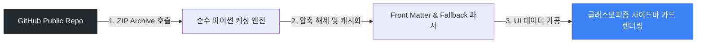
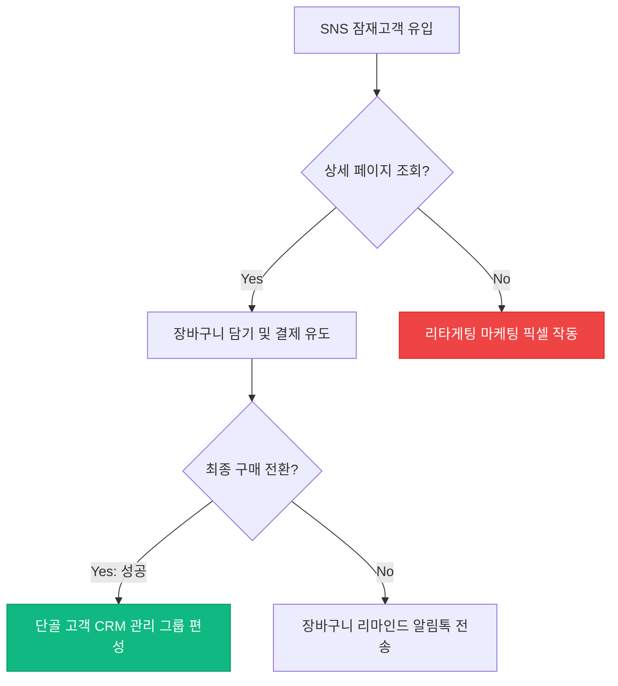

# 📡 Joy Markdown Studio - 원격 구독(RSS) 템플릿 제작 및 배포 가이드
> **원격 GitHub 저장소를 활용해 자신만의 학술/실무 템플릿 서재를 구축하고 팀원들과 실시간으로 공유/구독하는 방법**

본 문서는 **Joy Markdown Studio v3.9.25**에 결합된 **사용자 정의 및 RSS 원격 구독 템플릿 플러그인**의 공식 마크다운 작성 규격 및 리포지토리 배포 가이드라인입니다.

---

## 💎 1. 원격 구독(RSS) 템플릿 아키텍처 개요
Joy Markdown Studio의 원격 구독 기능은 **무의존성(No Git) 순수 파이썬 캐싱 엔진**을 기반으로 동작합니다. 

사용자가 특정 GitHub 리포지토리 주소를 에디터에 등록하면, 백엔드에서 해당 저장소의 최신 브랜치 ZIP 아카이브를 호출해 압축을 풀고, 그 안의 마크다운(`.md`) 파일들을 실시간 파싱하여 프론트엔드 사이드바의 템플릿 카드로 동적 변환합니다.



---

## 📐 2. 표준 템플릿 작성 규격 (YAML Front Matter)
마크다운 파일의 맨 최상단에 `---` 기호로 구분된 **YAML Front Matter** 블록을 선언하여 템플릿의 외관과 이름, 속성을 직접 완벽하게 디자인할 수 있습니다.

### 📝 YAML Front Matter 스펙 필드:
| 필드명 | 데이터 타입 | 설명 및 권장 규격 | 예시 |
| :--- | :---: | :--- | :--- |
| **`template_title`** | String | 사이드바 템플릿 카드의 **메인 제목** (이모지 포함 권장) | `"🚀 자산 배분 일지"` |
| **`template_desc`** | String | 템플릿에 대한 **1줄 요약 설명** | `"켈리 공식을 활용한 자산 비중 관리"` |
| **`template_icon`** | String | 카드의 대표 **Lucide 아이콘 키** (3장 참고) | `"line-chart"` |
| **`template_color`** | Hex Code | 카드의 왼쪽 포인트 바 및 아이콘에 입혀질 **색상** | `"#10b981"` |
| **`tags`** | Array | 템플릿 분류용 해시태그 목록 | `[투자, 자산배분]` |

---

## 💡 3. 실제 마크다운 템플릿 파일 샘플 (복사용)
자신의 저장소에 마크다운 파일(`.md`)을 생성하고 아래의 예시를 그대로 복사하여 커스터마이징해 보십시오.

```markdown
---
template_title: "📊 주간 비즈니스 R&R 보고서"
template_desc: "부서별 R&R 점검 및 핵심 KPI 달성 지표 추적용 실무 문서 양식"
template_icon: "layout-template"
template_color: "#6366f1"
tags: [실무, 업무일지, 보고서]
---

# 📊 주간 비즈니스 R&R 및 핵심 KPI 보고서

**작성 일자:** 2026-06-03
**보고 부서:** 기획마케팅본부 | **작성자:** 홍길동 팀장

---

## 📐 1. 세부 업무 달성률 계산 공식 (KaTeX)
업무의 가중치($W_i$)와 실제 달성률($A_i$)을 반영한 주간 종합 KPI 달성 지표 계산 공식입니다.

$$
KPI_{total} = \frac{\sum_{i=1}^{n} (W_i \times A_i)}{\sum_{i=1}^{n} W_i} \times 100 (\%)
$$

---

## ⚙️ 2. 마케팅 퍼널 분석 흐름도 (Mermaid)


```

---

## 🛡️ 4. 안전 대체 메커니즘 (Fallback 규칙)
만약 YAML Front Matter 블록(`---`)이 존재하지 않는 평범한 마크다운 문서를 업로드하더라도, 에디터 파서가 본문을 정밀 분석하여 자동으로 UI를 채워줍니다.

- **이름 (Title)**: 본문 내부의 첫 번째 대제목(`# 제목`)을 자동 감지해 템플릿 이름으로 씁니다. 만약 제목조차 없다면 **마크다운 파일명(확장자 제외)**을 이름으로 강제 적용합니다.
- **설명 (Description)**: 기본값인 `"원격 구독 양식 문서"`가 할당됩니다.
- **아이콘 (Icon)**: 기본 규격인 `"file-text"` (일반 텍스트 문서 모양) 아이콘이 지정됩니다.
- **색상 (Color)**: RSS 테마를 상징하는 시원한 파란색 계열(`"#3b82f6"`) 포인트 바가 입혀집니다.

---

## 🎨 5. 사용 가능한 핵심 Lucide 아이콘 및 추천 컬러 리스트
Joy Markdown Studio는 **Lucide 아이콘 팩**과 완전히 호환됩니다. 대표적으로 가장 잘 어울리는 아이콘 키와 색상 가이드라인입니다.

### 🔍 추천 아이콘 키 (Lucide Icon Keys):
- **`book`** / **`book-open`** : 학술 보고서, 연구 논문, 독서 노트 템플릿
- **`layout-template`** / **`file-text`** : 기본 범용 문서, 보고서 양식
- **`line-chart`** / **`trending-up`** : 자산 배분, 주식 분석, 매매일지, 데이터 통계
- **`check`** / **`check-square`** : TODO 리스트, 프로젝트 일정, 체크리스트
- **`code`** / **`terminal`** : 개발 일지, 알고리즘 분석, API 개발 명세서
- **`heart`** / **`activity`** : 데일리 일기, 운동 기록, 바이오 헬스 케어

### 🎨 추천 포인트 컬러칩 (Hex Colors):
- <span style="color:#ec4899">■</span> **Pink (`#ec4899`)** : 크리에이티브, 예술, 일기장 템플릿에 최적
- <span style="color:#3b82f6">■</span> **Blue (`#3b82f6`)** : 프로페셔널, 학술 연구, RSS 및 시스템 템플릿
- <span style="color:#10b981">■</span> **Green (`#10b981`)** : 생산성, 할 일 목록, 오답노트, 건강 기록
- <span style="color:#f59e0b">■</span> **Amber (`#f59e0b`)** : 경고, 긴급 체크리스트, 주간 플래너
- <span style="color:#8b5cf6">■</span> **Purple (`#8b5cf6`)** : 퀀트 투자, 뇌과학 분석, 고급 전문 양식

---

## 🚀 6. GitHub 저장소를 통한 배포 순서
1. **GitHub Public 리포지토리 생성** (예: `https://github.com/your-username/my-templates`)
2. 제작한 마크다운 파일들(`.md`)을 저장소 최상단 혹은 하위 폴더에 업로드합니다.
3. Joy Markdown Studio를 켜고 왼쪽 템플릿 사이드바 상단의 **`RSS`** 버튼을 클릭합니다.
4. 리포지토리 주소를 입력하고 **`추가`** 버튼을 누르면, 단 몇 초 만에 나만의 템플릿들이 파란색 `RSS` 뱃지를 달고 완벽하게 라이브러리에 동기화됩니다!
