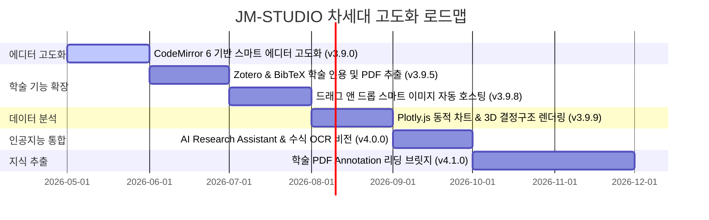

# 🚀 Joy Markdown Studio (JM-STUDIO) Updates Roadmap

> **Ultimate Science & Engineering Research and Academic Markdown Editing & Visualization Studio**  
> 본 로드맵은 v3.8.1 성공적인 릴리즈 이후, JM-STUDIO를 세계 최고 수준의 이공계 학술 연구용 마크다운 스튜디오로 도약시키기 위한 공식 제품 로드맵 및 기술 업데이트 계획서입니다.

---

## 📌 제품 지향점 (Product Identity)
JM-STUDIO는 단순한 범용 지식 기록 장치(Zettelkasten)인 Obsidian 등과 차별화되며, **"이공계 학술 연구자가 아무런 사전 설정 없이 즉시 논문을 쓰고, 공식을 설계하며, 분자식을 시각화하고, 데이터를 동적 차트화하는 풀옵션 장착 프리미엄 학술 스튜디오"**를 완벽히 지향합니다.

---

## 🗺️ 기술 업데이트 로드맵 요약 (Overview)



---

## 🎉 현재까지 완료 및 추가된 주요 기능 (v3.9.0 ~ v3.9.22)

기존 로드맵의 마일스톤 계획을 훨씬 상회하는 수준 높은 프리미엄 기능들이 대대적으로 완비되었습니다:

*   **[✔] Phase 1: CodeMirror 6 기반 스마트 에디터 고도화 완료 (v3.9.0)**
*   **[✔] 구글 드라이브(Google Drive) 양방향 실시간 동기화 및 클라우드 조회 (v3.9.1)**
*   **[✔] UI 글꼴 및 이공계 코딩 고정폭 글꼴 다이내믹 설정 (v3.9.2)**
*   **[✔] 이모지 피커 대대적 속도 향상 (로컬 오프라인 작동 및 60fps GPU 가속) (v3.9.3)**
*   **[✔] 릴리즈 독립 빌드용 디버그 도구 해제 및 안정화 (v3.9.4)**
*   **[✔] 10열 이모지 그리드 및 카테고리 탭 잘림 버그 최종 교정 (v3.9.5)**
*   **[✔] 외부 절대 경로 파일 크래시 해결 및 백엔드 API 안정성 강화 (v3.9.6)**
*   **[✔] 학술/이공계 맞춤 마크다운 템플릿(9종) 도우미 및 지능형 새 파일 론칭 (v3.9.7)**
*   **[✔] PyPI 저장소 연동 비동기 최신 버전 감지 및 글래스모피즘 업그레이드 모달 (v3.9.8)**
*   **[✔] YAML Front Matter 기반 해시태그 & 사이드바 태그 브라우저 탑재 (v3.9.9)**
*   **[✔] 파이썬 정식 패키지 구조(`jmstudio`) 재설계 및 론처 수신기 개선 (v3.9.19)**
*   **[✔] 로컬 부팅 시 웹서버 바인딩 시간 보정을 위한 소켓 대기 제어 (v3.9.19)**
*   **[✔] 내서재 목록 제외(삭제) JavaScript ReferenceError 버그 교정 완료 (v3.9.20)**
*   **[✔] 에디터 상단 툴바(굵게, 기울이기, 이모지, 되돌리기 등) 및 목록/머리글 다국어 번역 교정 (v3.9.20)**
*   **[✔] 브라우저 기본 confirm을 대체하는 커스텀 글래스모피즘 형광 스타일 대화창 탑재 (v3.9.20)**
*   **[✔] 서재 파일 삭제 시 우측 목차(TOC) 패널 즉시 리셋 및 숨김 싱크 구현 (v3.9.20)**
*   **[✔] 하이브리드 WYSIWYG 모드 고급 렌더링(수식, 화학식, 다이어그램, 차트, 표) 완성 및 수식 엔터 크래시(JS Error) 소멸 (v3.9.21)**
*   **[✔] 전체화면 팝업 캡처 오류 필터링 보강 및 사용자 수동 HTML 줌/전체화면 window 바인딩 적용 (v3.9.21)**
*   **[✔] WYSIWYG 마인드맵 스캐너 오버플로우 보정 및 코드 빈 줄 끊김 현상 완벽 해결 (v3.9.21)**
*   **[✔] 프리미엄 PDF 인쇄 및 미리보기 정밀 레이아웃 정합성 완비 및 자바스크립트 기반 동적 정적 페이지 분할 엔진(Static Pagination Engine) 탑재 (v3.9.22)**
*   **[✔] PDF A4 종이 기하학(210mm x 297mm) 단위의 정적 분할을 통한 counter(page) 렌더러 카운팅 오작동 원천 우회 (v3.9.22)**
*   **[✔] 인쇄 본문-머리말/꼬리말 음수 마진 폐기 및 본문 패딩 격리를 통한 다중 페이지 겹침 방지 (v3.9.22)**
*   **[✔] 프론트엔드 HTML 로딩 모듈 파일 버스팅 캐싱(Cache-busting) v3.9.22 쿼리 스트링 일괄 주입 (v3.9.22)**
*   **[✔] Quarto 및 Pandoc 학술 컴파일러 연동 및 로컬 PDF 미리보기 뷰어 통합 (v3.9.23)**
*   **[✔] 네트워크 지연(get_local_ip) 및 PyPI 최신 버전 체크 비동기 스레드 위임 시작 지연 0초대 복원 (v3.9.24)**
*   **[✔] Google Drive Sync API Lazy Properties 및 무거운 구글 종속성 라이브러리 로컬 임포트 최적화 (v3.9.24)**
*   **[✔] PDF 미리보기 500 에러 해결 및 pywebview 내장 환경의 로컬 파일 다운로드(네이티브 저장 대화상자) 연동 (v3.9.25)**
*   **[✔] 1920x1080 및 소형 해상도 툴바 단추 잘림/개행 방지 및 창 크기 기반 동적 헤더 스케일러 연동 (v3.9.25)**
*   **[✔] 로컬 포트 검사 루프 타임아웃 단축(10s -> 0.3s) 및 NameError 핫픽스 적용, 사용자의 단일 파일 선호에 맞추어 PyInstaller --onefile 복원 및 패키지 자동화 (v3.9.26)**

---

## 🛠️ 세부 마일스톤 및 기술 스펙 (Milestones)

### 💎 Phase 1: 에디터 코어 고도화 (v3.9.0) - [✔] 완료
기존의 단순 HTML `<textarea>` 구조를 극복하고 전문적인 마크다운 타이핑을 실현했습니다.

> [!TIP]
> **CodeMirror 6 도입**
> - **목적**: 코딩 편집 및 마크다운 수식 작성 시 에디터 자체 시인성 극대화.
> - **주요 기능**:
>   - [✔] 에디터 내 마크다운 문법 실시간 하이라이팅.
>   - [✔] 괄호 짝 맞추기, 들여쓰기 자동 정렬, 멀티 커서 제공.
>   - [✔] 수식(`$...$`), 화학식(````smiles ````)에 대한 내부 하이라이팅 확장팩 완비.

---

### 🎓 Phase 2: 학술 인용 및 자산 관리 자동화 (v3.9.5 ~ v3.9.8 목표) - [ ] 진행 예정
논문 저술에 완벽하게 정합할 수 있도록 참고문헌과 학술용 자산을 똑똑하게 관리합니다.

> [!IMPORTANT]
> **Zotero & BibTeX 표준 학술 인용 렌더링**
> - [ ] 서재 폴더 내 `references.bib` 파일을 자동 스캔 및 인덱싱.
> - [ ] 에디터 상에서 `[@citation_key]` 입력 시 스마트 자동완성 팝업 가동.
> - [ ] Standalone HTML 익스포트 및 A4 PDF 인쇄 시 **하단에 IEEE/APA 스타일 참고문헌 리스트 자동 생성 및 포맷팅**.
> - [ ] **PDF 드롭 및 메타데이터 자동 추출**: 학술 논문 PDF 파일을 드롭하면 CrossRef API를 통해 저자, 제목, 저널명 등의 BibTeX 데이터를 실시간 파싱하여 `references.bib`에 자동 추가하는 기능.

> [!NOTE]
> **드래그 앤 드롭 스마트 이미지 자동 호스팅**
> - 이미지 파일을 에디터에 드롭하거나 스크린샷 붙여넣기(`Ctrl+V`) 시:
>   - [ ] 현재 워크스페이스 하위의 `assets/images/` 폴더에 타임스탬프 기반 파일로 자동 변환 저장.
>   - [ ] 마크다운 이미지 링크(``) 자동 주입.

---

### 📊 Phase 3: Plotly.js 기반 동적 데이터 시각화 (v3.9.9 목표) - [ ] 진행 예정
데이터 테이블 및 플로팅 수치를 캡처본이 아닌 살아 움직이는 인터랙티브 차트로 즉시 감상합니다.

> [!WARNING]
> **Plotly.js & Chart.js 엔진 연동**
> - [ ] 마크다운 내 데이터 테이블 혹은 ````chart ```` 코드 블록 작성 시 실시간 그래픽 렌더링.
> - [ ] **분포도(Scatter Plot), 선 차트(Line Chart), 3D 벡터 흐름도** 지원.
> - [ ] 줌 인/아웃, 개별 데이터 포인트 오버레이 및 이미지로 저장 기능 탑재.
> - [ ] **3D 결정 구조 및 분자 오비탈 시각화 (v3.9.10 목표)**: 재료공학 및 화학 연구자를 위한 `.cif` (Crystallographic) 결정 파일 및 `.xyz` 분자 파일 본문 내 3D 대화형 로테이션 렌더링 지원.

---

### 🤖 Phase 4: AI Research Assistant (v4.0.0 메이저 릴리즈 목표) - [ ] 진행 예정
수동 작성의 장벽을 뛰어넘어, 학술 AI 비서가 내 수식과 화학 구조를 정교화해줍니다.

> [!CAUTION]
> **로컬 LLM (Ollama) 및 Cloud OpenAI API 연동**
> - [ ] **AI 연구 어시스턴트 패널**: 우측 TOC 슬라이딩 영역에 별도 탭으로 탑재.
> - [ ] **핵심 AI 지원 기능**:
>   - [ ] "이 수식을 슈뢰딩거 3차원 정상파 방정식으로 다듬어줘" -> KaTeX 자동 렌더링 검수.
>   - [ ] "아스피린과 구조가 비슷한 물질의 SMILES 코드를 알려줘" -> SMILES 블록 원클릭 빌드.
>   - [ ] "내가 열어둔 서재 문서들 기반으로 지식 그래프 상에서 밀접한 아이디어 요약해줘".
>   - [ ] **필기/인쇄 수식 이미지 LaTeX OCR 스캐너**: 논문 캡처본 또는 화이트보드 필기 수식 이미지를 복사-붙여넣기 시, Vision AI가 LaTeX/KaTeX 마크다운 수식 코드로 완벽 변환해 주는 비전 기능.

---

### 📖 Phase 5: 학술 PDF 리딩 & 하이라이트 지식 추출 브릿지 (v4.1.0 목표) - [ ] 진행 예정
외부 PDF 리더로 번거롭게 화면을 오가던 흐름을 완전히 해결하고 서재 내부에서 원스톱으로 독서 노트를 생산합니다.

> [!TIP]
> **Side-by-Side PDF Annotator & Knowledge Extractor**
> - [ ] **PDF 내장 뷰어 연동**: 마크다운 에디터와 PDF 파일을 화면 분할(Split)하여 동시 표출.
> - [ ] **원클릭 하이라이트 인용 주입**: PDF 뷰어 내에서 드래그하여 형광펜 칠한 텍스트나 그림 캡처를 클릭 한 번으로 내 활성화된 마크다운 노트로 인용구 형식 복사 주입.
> - [ ] **논문 메타데이터 카드 바인딩**: 읽고 있는 논문의 초록, 키워드를 마크다운 상단 YAML Front Matter 메타데이터와 결합하여 Zettelkasten 지식 그래프와 다이내믹 연결.

---

## 📈 장기 로드맵 검토 과제 (Backlog Items)
1. **[ ] Typora식 위지윅(WYSIWYG) 하이브리드 실시간 편집 모드**: 프리뷰와 에디터를 단일 통합 뷰로 제공.
2. **[ ] 실시간 클라우드 동시 편집(Co-editing) 기술**: 여러 명이 하나의 서재에서 협업하는 기능.
3. **[ ] 학술 논문 커스텀 템플릿 제공**: Nature, IEEE, Springer 포맷에 맞춘 문서 레이아웃 원클릭 출력 엔진.

---
*본 로드맵은 JM-STUDIO의 공식 개발 가이드라인으로 활용되며, 마일스톤에 맞게 투명하고 체계적으로 진행될 예정입니다.* 🚀
