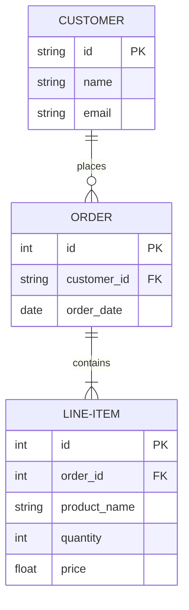
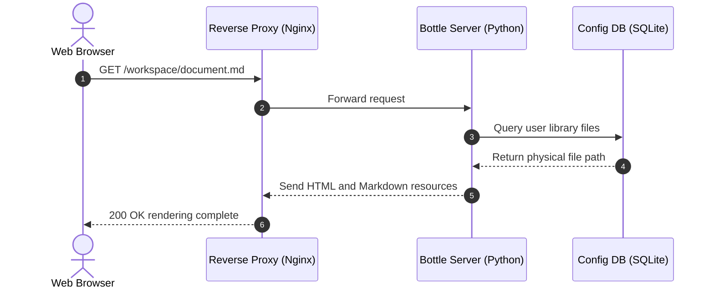
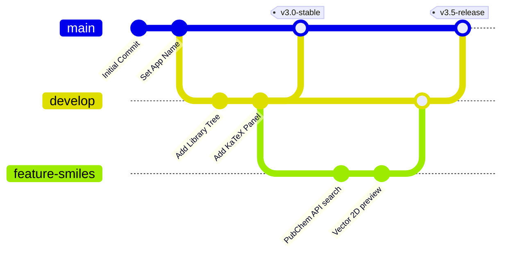
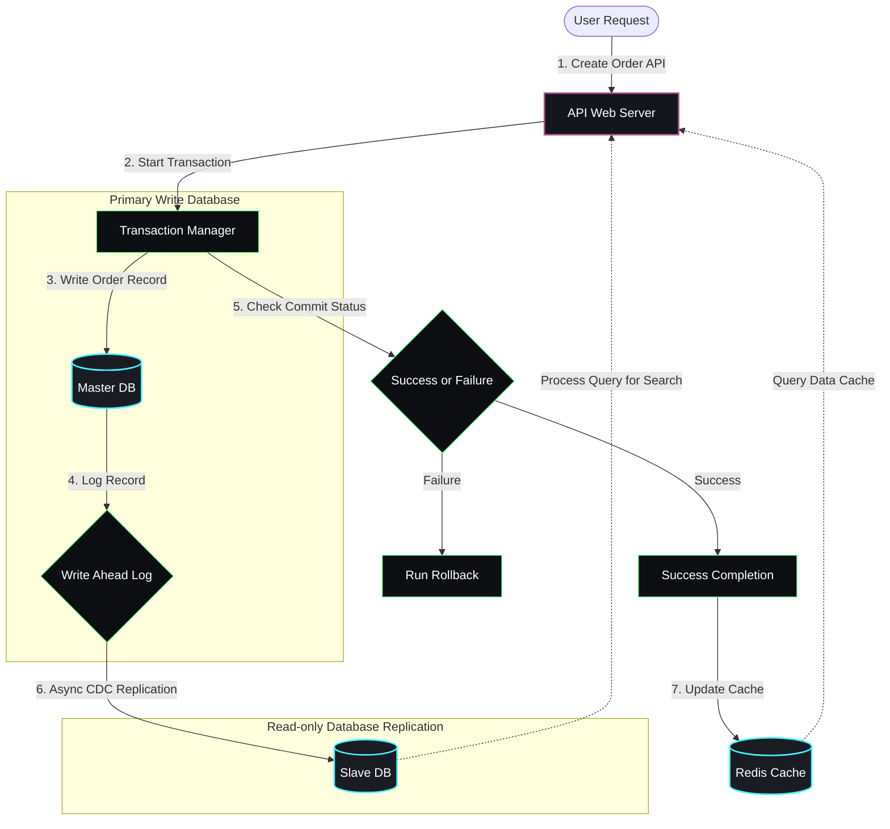
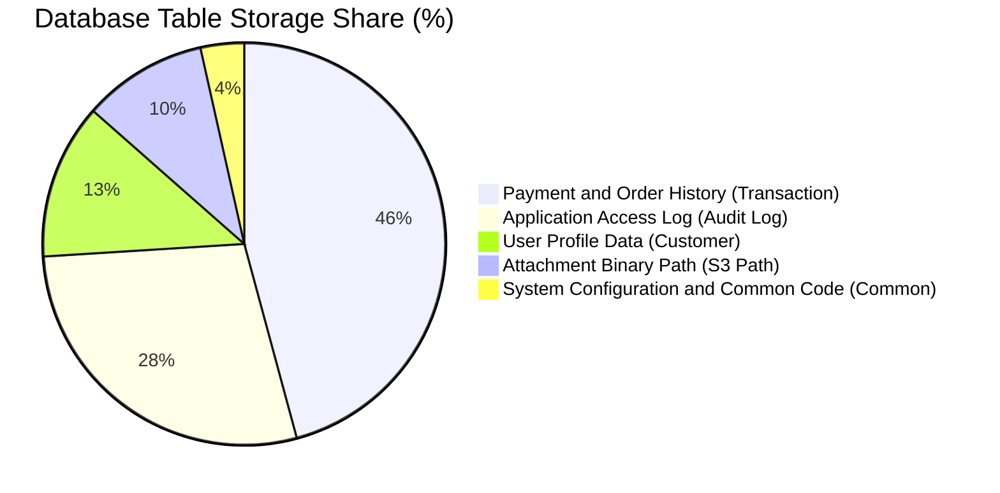
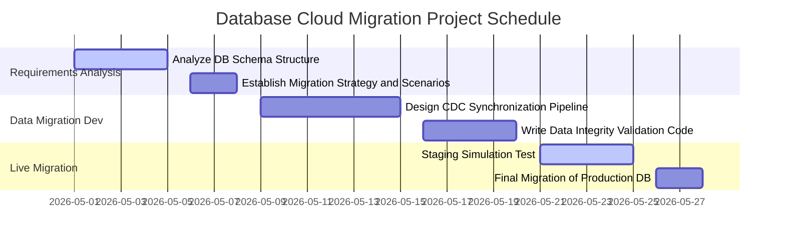

# 💻 Computer Science Markdown Practical Guide

Joy Markdown Studio supports the best markdown rendering specifications required for computer science and IT practice, such as programming source code highlighting, system architecture diagram design, and algorithm time complexity (Big-O) math formula descriptions.

Try editing and viewing markdown techniques frequently used in computer science through this guide!

---

## ⌨️ 1. Shortcuts and Inline Code Representation
In computer engineering documents, settings, commands, and shortcuts must be clearly distinguished.

* **Inline Code**: Use single backticks (`` ` ``) inline within text.
  * Example: To initialize a local repository, type the `git init` command. The `main()` function is the entry point of the program.
* **Keyboard Shortcuts**: Use HTML `<kbd>` tags to render actual keyboard buttons.
  * Example: To save the document, press <kbd>Ctrl</kbd> + <kbd>S</kbd>, and to undo, press <kbd>Ctrl</kbd> + <kbd>Z</kbd>.

---

## 📐 2. Algorithms and Artificial Intelligence Math Formulas (KaTeX)
Supports writing algorithm time complexity expressions (Big-O), probability theory, and neural network formulas for AI.

### A. Algorithm Time Complexity (Big-O Notation)
* Average time complexity of Quick Sort: $\mathcal{O}(N \log N)$
* Time complexity of matrix multiplication algorithm: $\mathcal{O}(N^3)$

### B. AI Activation Function (Neural Network Activation)
The Sigmoid function equation is defined as follows:

$$\sigma(z) = \frac{1}{1 + e^{-z}}$$

---

## 💻 3. Programming Source Code Highlighting (Syntax Highlighting)
Specifying the language of a code block syntax-highlights keywords, functions, and arguments in context.

```python
def fibonacci(n):
    """Generates Fibonacci sequence as a generator."""
    a, b = 0, 1
    for _ in range(n):
        yield a
        a, b = b, a + b

# Output up to the 10th term
for num in fibonacci(10):
    print(num, end=" ")
```

```sql
-- Query to retrieve database user information
SELECT user_id, username, email, created_at 
FROM users 
WHERE status = 'ACTIVE' 
ORDER BY created_at DESC 
LIMIT 10;
```

---

## 📊 4. System Design and Architecture Diagrams (Mermaid)

Writing diagrams in text draws them automatically as graphics, and double-clicking them zooms them to full screen to view large designs in high resolution!

### A. Database Design (Entity Relationship Diagram - ERD)
Intuitively maps database table structures and Primary Key (PK)/Foreign Key (FK) relations.



### B. Client-Server API Request (Sequence Diagram)
Visualizes asynchronous API transaction flows occurring in web/app services.

```mermaid
sequenceDiagram
    autonumber
    actor Client as Web Browser
    participant Proxy as Reverse Proxy (Nginx)
    participant Server as Bottle Server (Python)
    participant DB as Config DB (SQLite)

    Client->{arrow}Proxy: GET /workspace/document.md
    Proxy->{arrow}Server: Forward request
    Server->{arrow}DB: Query user library files
    DB--{arrow}Server: Return physical file path
    Server--{arrow}Proxy: Send HTML and Markdown resources
    Proxy--{arrow}Client: 200 OK rendering complete
```

Wait, let's fix the arrows in the Sequence Diagram:
`->` -> `->>`
`--` -> `-->>`
Let's make sure the sequence diagram matches exactly:


Let's do the rest:

### C. Version Control Flow (Git Graph)
Models the development team's branch merge and deployment history using a git graph.



---

## 💾 5. Database Transaction Flow & Chart Visualization Examples

Examples of writing database synchronization, replication architecture flows, and operational statistics charts in markdown.

### A. Database Transaction & Real-time Replication Flowchart
Visualizes microservice flows such as master DB writes, WAL (Write Ahead Log) storage, slave DB replication, and Redis cache updates in response to user requests.



### B. Database Storage Space Allocation (Pie Chart)
A chart showing database table capacity allocation and retention rates at a glance.



### C. Database Migration Schedule (Gantt Chart)
Easily write Gantt charts, which are essential for IT project schedule management.



---

## 📝 6. Collaboration and Task Management (Task List)
Used as a project feature development status or requirements checklist.

- [x] **Sprint 1**: Develop basic markdown parser feature
- [x] **Sprint 2**: Integrate KaTeX formulas and science/engineering math helper
- [x] **Sprint 3**: Integrate PubChem OpenAPI and load 2D Smiles viewer
- [ ] **Sprint 4**: Additional design for markdown PDF conversion engine
- [ ] **Sprint 5**: Support simultaneous activation of multiple workspaces

---
**Joy Markdown Studio** is constantly evolving to make it easy and beautiful to manage computing and computer science research documents! 💻🚀
