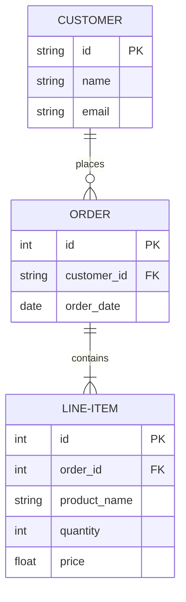
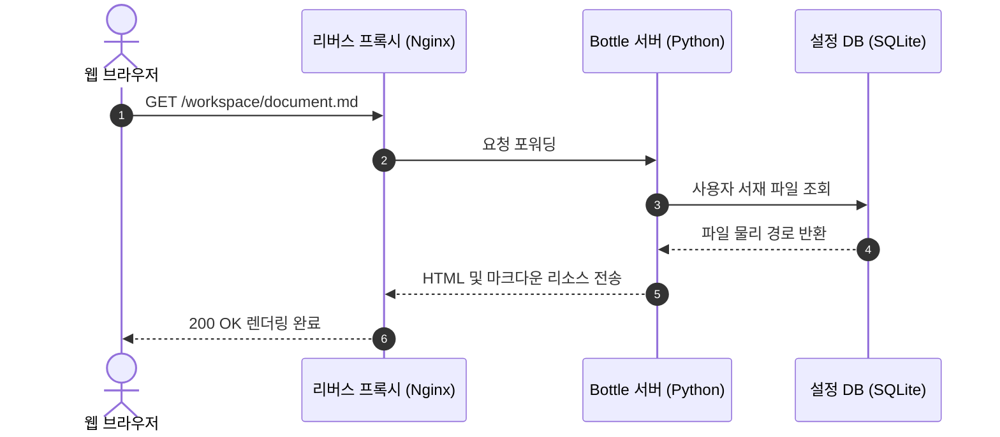
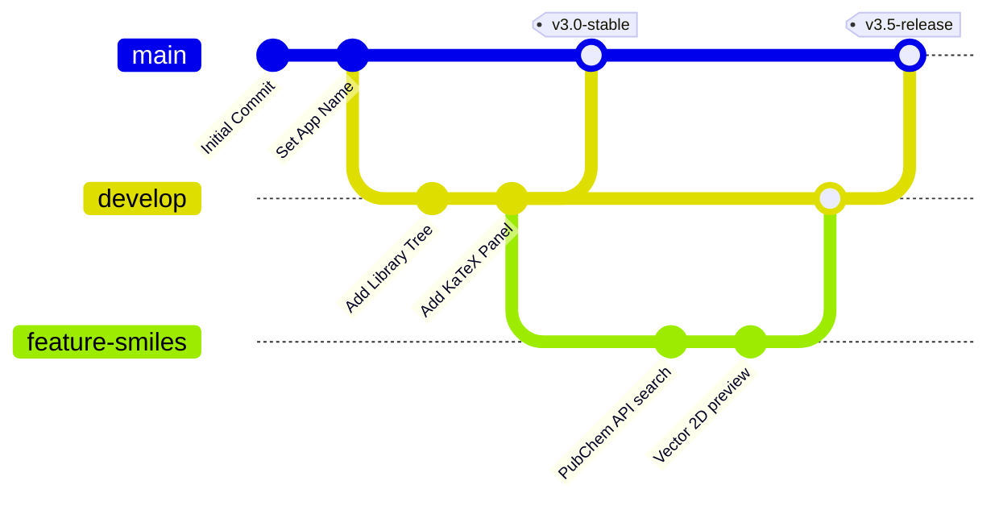
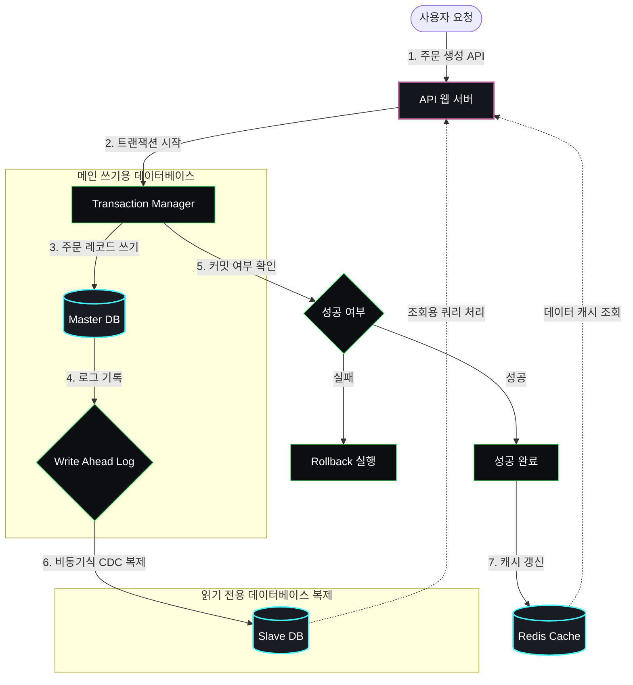
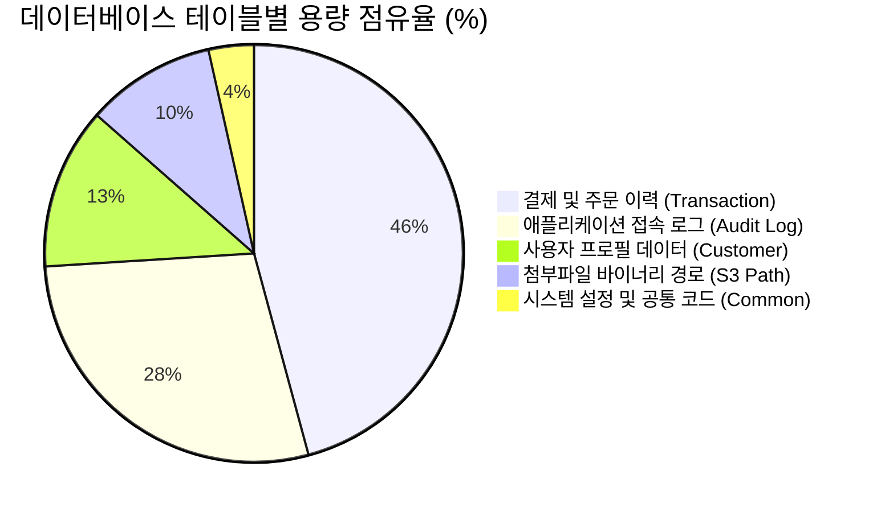
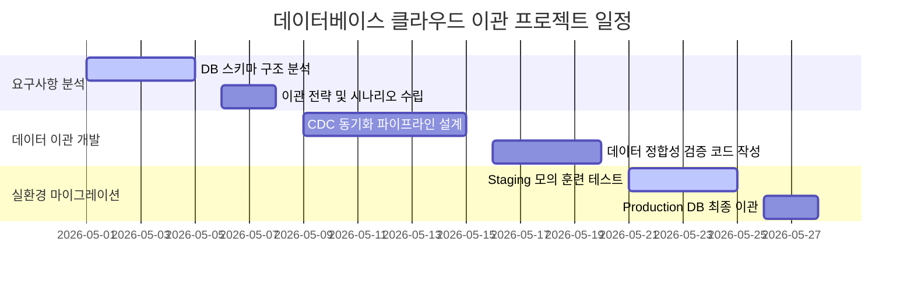

# 💻 전산 및 컴퓨터 과학 (Computer Science) 마크다운 활용 가이드

Joy Markdown Studio는 프로그래밍 소스 코드 강조, 시스템 아키텍처 다이어그램 설계, 알고리즘 시간 복잡도(Big-O) 수식 기술 등 컴퓨터 과학 및 IT 실무 분야에 필요한 최고의 마크다운 렌더링 스펙을 지원합니다.

본 가이드를 통해 전산 분야에서 자주 활용되는 마크다운 기법들을 직접 편집하고 감상해 보세요!

---

## ⌨️ 1. 단축키 및 인라인 코드 표현
컴퓨터 공학 문서에서는 설정값, 명령어, 단축키를 명확히 구분해야 합니다.

* **인라인 코드**: 텍스트 사이에 기입하는 단일 백틱(`` ` ``)을 사용합니다.
  * 예: 로컬 저장소를 초기화하려면 `git init` 명령어를 입력하세요. `main()` 함수는 프로그램의 시작점입니다.
* **키보드 단축키**: HTML `<kbd>` 태그를 이용해 실제 키보드 단추 모양을 연출합니다.
  * 예: 문서를 저장하려면 <kbd>Ctrl</kbd> + <kbd>S</kbd>를 누르시고, 되돌리려면 <kbd>Ctrl</kbd> + <kbd>Z</kbd>를 누르세요.

---

## 📐 2. 알고리즘 및 인공지능 수학 공식 (KaTeX)
컴퓨터 과학의 시간 복잡도 표현(Big-O), 확률론, 인공지능 신경망 수식 작성을 지원합니다.

### A. 알고리즘 시간 복잡도 (Big-O Notation)
* 퀵 정렬(Quick Sort)의 평균 시간 복잡도: $\mathcal{O}(N \log N)$
* 행렬 곱셈 알고리즘의 시간 복잡도: $\mathcal{O}(N^3)$

### B. 인공지능 활성화 함수 (Neural Network Activation)
시그모이드(Sigmoid) 함수 식은 다음과 같이 정의됩니다:

$$\sigma(z) = \frac{1}{1 + e^{-z}}$$

---

## 💻 3. 프로그래밍 소스 코드 강조 (Syntax Highlighting)
코드 블록 언어 지정 시 키워드, 함수, 인수가 문맥에 맞게 구문 강조됩니다.

```python
def fibonacci(n):
    """피보나치 수열을 제너레이터 형태로 생성합니다."""
    a, b = 0, 1
    for _ in range(n):
        yield a
        a, b = b, a + b

# 10번째 항까지 출력
for num in fibonacci(10):
    print(num, end=" ")
```

```sql
-- 데이터베이스 사용자 정보 조회 쿼리
SELECT user_id, username, email, created_at 
FROM users 
WHERE status = 'ACTIVE' 
ORDER BY created_at DESC 
LIMIT 10;
```

---

## 📊 4. 시스템 설계 및 아키텍처 다이어그램 (Mermaid)

텍스트로 작성하면 그래픽으로 자동 드로잉되며, 더블 클릭하면 **전체화면 줌**을 통해 거대한 설계도도 고해상도로 볼 수 있습니다!

### A. 데이터베이스 설계 (Entity Relationship Diagram - ERD)
데이터베이스의 테이블 구조와 기본키(PK)/외래키(FK) 릴레이션을 직관적으로 매핑합니다.



### B. 클라이언트-서버 API 요청 (Sequence Diagram)
웹/앱 서비스에서 발생하는 비동기 API 트랜잭션 흐름을 시각화합니다.



### C. 형상 관리 흐름 (Git Graph)
개발팀의 브랜치 병합 및 배포 히스토리를 깃 그래프로 모델링합니다.



---

## 💾 5. 데이터베이스 트랜잭션 흐름 & 챠트 시각화 예제

데이터베이스 동기화, 이중화 아키텍처 흐름 및 운영 통계 챠트를 마크다운 상에서 작성하는 예제입니다.

### A. 데이터베이스 트랜잭션 & 실시간 복제(Replication) 흐름도
사용자 요청에 따른 마스터 DB 기록, WAL(Write Ahead Log) 저장, 슬레이브 DB 복제 및 Redis 캐시 갱신 등의 마이크로서비스 흐름을 시각화합니다.



### B. 데이터베이스 스토리지 공간 배분 (원형 챠트 - Pie Chart)
DB 테이블 용량 할당 및 보존율을 한눈에 표시하는 챠트입니다.



### C. 데이터베이스 마이그레이션 일정 (간트 챠트 - Gantt Chart)
전산 프로젝트 일정 관리에 필수적인 간트 챠트도 손쉽게 작성 가능합니다.



---

## 📝 6. 협업 및 태스크 관리 (Task List)
프로젝트 기능 개발 현황이나 요구사항 대조표로 활용됩니다.

- [x] **스프린트 1**: 마크다운 기본 파서 기능 개발
- [x] **스프린트 2**: KaTeX 수식 및 이공계 수식 도우미 연동
- [x] **스프린트 3**: PubChem OpenAPI 연동 및 2D Smiles 뷰어 탑재
- [ ] **스프린트 4**: 마크다운 PDF 변환 엔진 추가 설계
- [ ] **스프린트 5**: 다중 워크스페이스 동시 활성화 지원

---
**Joy Markdown Studio**는 전산 및 컴퓨터 공학 연구 문서를 쉽고 아름답게 관리할 수 있도록 끊임없이 진화하고 있습니다! 💻🚀
