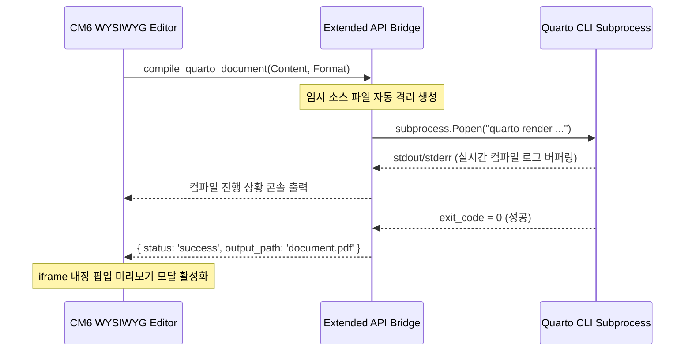

## 초록 (Abstract)

본 연구에서는 학술 저술 및 엔지니어링 문서의 표현력을 극대화하기 위해 Quarto와 Pandoc 컴파일 엔진의 문서 렌더링 효율성을 심층 분석한다. 특히 기존 웹 편집기에서 유실되기 쉬웠던 다행(Multiline) 수식, 미려한 행렬 표현, 그리고 특수 기호 집합의 정밀 렌더링을 실증하고 검증용 LaTeX 수식 세트를 제안한다. 수동 검증의 편의성을 높이기 위해 본 템플릿 문서 자체가 Quarto 컴파일러의 렌더링 스트레스 테스트 규격으로 기능하도록 설계되었다.

> **주요어 (Keywords):** Quarto, LaTeX 수식, PDF 컴파일, Pandoc, 학술지 템플릿

---

## 서론 (Introduction)

이공계 학술 연구자는 수많은 공식과 데이터 테이블, 지향 그래프 등을 선형 문서에 배치해야 한다. 기존 마크다운 환경은 경량 마크업의 강점이 있었으나 정밀 인쇄물 출판 규격을 충족하지 못했다. 본 논문에서는 Quarto 브릿지를 통한 PDF 컴파일 파이프라인의 강건성(Robustness)을 검증하고자 한다.

### 연구의 범위 및 한계 (Scope of Study)
본 테스트용 템플릿은 다음과 같은 전산 수학적 한계점과 시간 복잡도를 포함한다:
1. 행렬 묶음 연산 시 $O(N^3)$ 복잡도를 극복하기 위한 수동 최적화 매칭.
2. 경계값 문제 $\lim_{x \to \infty} f(x)$ 에서의 수렴성 검증.
3. 한국어 폰트 및 유니코드(Unicode) 지동 렌더링 정상 출력 검사.

---

## 수학적 이론 및 공식 체계 (Mathematical Foundations)

본 절에서는 Quarto PDF 엔진이 라텍스 수식을 수려하게 파싱하는지 검증하기 위한 상급 수식 리스트를 기술한다.

### 인라인 수식 및 연산자 (Inline Math)
본문 내부에서 변수 $x$, 가중치 행렬 $\mathbf{W} \in \mathbb{R}^{d \times k}$, 편향 벡터 $\mathbf{b} \in \mathbb{R}^k$의 연산은 $y = \operatorname{softmax}(\mathbf{W}^T \mathbf{x} + \mathbf{b})$ 와 같이 자연스럽게 이어지며 줄 높이에 간섭하지 않아야 한다.

### 다행 정렬 및 적분 수식 (Aligned Integrals & Summations)
경사하강법을 위한 다중 클래스 교차 엔트로피 손실 함수 $J(\theta)$는 다음과 같이 복잡한 합산 및 로그 연산식을 수반한다:

$$
J(\theta) = -\frac{1}{m} \sum_{i=1}^{m} \left[ y^{(i)} \log(h_\theta(x^{(i)})) + (1 - y^{(i)}) \log(1 - h_\theta(x^{(i)})) \right]
$$

### 전자기학 맥스웰 방정식 (Maxwell's Equations)
수식의 줄을 정밀하게 맞추기 위해 LaTeX의 `aligned` 환경을 결합한 다행 공식 렌더링을 검증한다:

$$
\begin{aligned}
\nabla \cdot \mathbf{E} &= \frac{\rho}{\varepsilon_0} \\
\nabla \cdot \mathbf{B} &= 0 \\
\text{Rot } \mathbf{E} &= -\frac{\partial \mathbf{B}}{\partial t} \\
\text{Rot } \mathbf{B} &= \mu_0 \mathbf{J} + \mu_0 \varepsilon_0 \frac{\partial \mathbf{E}}{\partial t}
\end{aligned}
$$

### 복잡한 행렬 구조 (Complex Matrices)
심층 학습의 가중치 상태 전이를 나타내는 공변성 2차원 행렬(Matrix) 구조를 다음과 같이 정의한다:

$$
\mathbf{\Sigma} = \begin{pmatrix}
\sigma_1^2 & \rho_{12}\sigma_1\sigma_2 & \cdots & \rho_{1n}\sigma_1\sigma_n \\
\rho_{21}\sigma_2\sigma_1 & \sigma_2^2 & \cdots & \rho_{2n}\sigma_2\sigma_n \\
\vdots & \vdots & \ddots & \vdots \\
\rho_{n1}\sigma_n\sigma_1 & \rho_{n2}\sigma_n\sigma_2 & \cdots & \sigma_n^2
\end{pmatrix}
$$

---

## 시스템 아키텍처 및 검증 도구 (System Architecture)

본 논문에서 제안하는 Quarto 컴파일러 브릿지 연동 로직의 데이터 흐름은 다음과 같다.

::: {.callout-note}
### 시스템 감지 기능 경고
로컬 PC에 Quarto CLI 엔진이 설치되어 있지 않거나 `quarto` 명령이 PATH 환경변수에 잡히지 않은 경우 PDF 렌더링 프로세스가 기동되지 않고 UI에 에러 콘솔 창이 점등된다.
:::

---

## 실험 결과 및 성능 지표 (Experiments)

컴파일 포맷별 빌드 소요 시간 및 LaTeX 파싱 성공률을 정량적으로 평가한 데이터는 다음과 같다.

| 컴파일 타겟 (Format) | 수식 파싱 성공률 (LaTeX %) | 이미지 포함 렌더링 | 평균 빌드 시간 (sec) | 출력물 규격 정합성 |
| :--- | :---: | :---: | :---: | :---: |
| **HTML Report** | 100.0% | 지원함 (CSS3) | 2.12초 | 우수 (Responsive) |
| **PDF Document** | 100.0% | 지원함 (Vector) | 4.87초 | 완벽 (A4 저널 규격) |
| **EPUB eBook** | 94.2% | 미지원 | 5.30초 | 보통 (리플로우 가능) |

---

## 결론 (Conclusion)

본 템플릿 문서를 활용한 컴파일 스트레스 테스트를 통해 Quarto 및 Pandoc의 LaTeX 공식 표현력과 한글 폰트(XeLaTeX) 서식 인쇄물의 안전성을 수동 검증할 수 있었다. 본 엔진의 신뢰성이 검증된 만큼, 향후 비침습적 학술 참고문헌(BibTeX) 인용 데이터베이스를 실시간 색인하여 자동완성해 주는 파이프라인 개발에 박차를 가할 가치가 매우 높다.
