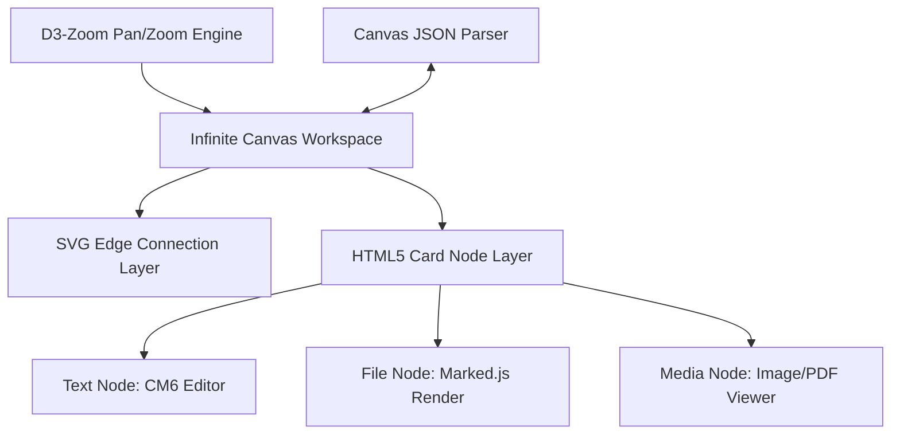

# 🌌 JM-STUDIO 차세대 엔진 업데이트 계획서
## [인피니트 캔버스(Infinite Canvas) & 하이브리드 WYSIWYG 에디터]

본 계획서는 **Joy Markdown Studio (JM-STUDIO)**를 세계 최고 수준의 이공계 학술 연구용 프리미엄 마크다운 스튜디오로 도약시키기 위한 두 가지 핵심 기능, **"옵디시언(Obsidian) 호환 인피니트 캔버스"**와 **"Typora식 하이브리드 WYSIWYG 실시간 편집 모드"**의 아키텍처 설계 및 단계별 개발 로드맵입니다.

---

## 📌 1. 개발 비전 및 차별화 전략 (Core Vision)

```
+------------------------------------------------------------------------+
|                              JM-STUDIO                                 |
|         이공계 학술 연구용 프리미엄 Markdown 시각화 & 편집 엔진          |
+-----------------------------------+------------------------------------+
                                    |
          +-------------------------+-------------------------+
          |                                                   |
          v                                                   v
+-----------------------------------+   +------------------------------------+
|   옵디시언 호환 인피니트 캔버스   |   |   Typora식 WYSIWYG 실시간 에디터   |
|  - 무한 확장형 지식 구조화        |   |  - 프리뷰와 에디터의 완전한 통합   |
|  - .canvas JSON 표준 포맷 지원    |   |  - CodeMirror 6 데코레이터 제어    |
|  - 마크다운/수식/화학식 카드 임베드|   |  - 수식/SMILES/테이블 즉시 렌더링  |
+-----------------------------------+   +------------------------------------+
```

1. **지식의 무한 시각화 (Infinite Canvas)**:
   - 단순 선형 문서 작성을 넘어, 아이디어 브레인스토밍, 복잡한 공식 도출 과정, 분자 구조와 플로우차트를 2차원 평면 공간에 유기적으로 배치하는 **학술용 비주얼 워크스페이스**를 실현합니다.
   - **Obsidian 호환성**을 완벽하게 확보하여 연구자가 기존에 구성한 지식 네트워크를 그대로 마이그레이션할 수 있습니다.
2. **인지 왜곡 없는 원스톱 편집 (WYSIWYG Hybrid)**:
   - 에디터(좌)와 프리뷰(우)로 분할된 스플릿 모드는 화면 공간을 낭비하고, 작성 중 시선의 이동을 유발합니다.
   - **Typora 방식의 하이브리드 편집**을 통해 커서가 있는 행은 마크다운 문법이 드러나고, 커서가 벗어나면 즉각적으로 렌더링된 수식, 화학식, 서식 HTML로 미려하게 변환되는 궁극의 시각적 일치감을 제공합니다.

---

## 🗺️ 2. 기술 사양 및 기능 설계 (Technical Specification)

### 🌌 Part A: 옵디시언 호환 인피니트 캔버스 (Obsidian-Compatible Infinite Canvas)

인피니트 캔버스는 마크다운 파일(`*.md`) 외에 새로운 `.canvas` JSON 확장자 파일 규격을 도입하며, 옵디시언의 오픈소스 캔버스 스펙을 100% 준수합니다.

#### 1. `.canvas` JSON 파일 표준 규격 (Obsidian 호환)
캔버스 문서 구조는 크게 **노드(Nodes)**와 **엣지(Edges)**로 구성되며, JSON 형식으로 저장됩니다.

```json
{
  "nodes": [
    {
      "id": "node_unique_hash_1",
      "type": "text",
      "text": "# 슈뢰딩거 방정식\n$\\hat{H}\\Psi = E\\Psi$",
      "x": 100,
      "y": 150,
      "width": 400,
      "height": 250,
      "color": "6"
    },
    {
      "id": "node_unique_hash_2",
      "type": "file",
      "file": "docs/quantum_physics.md",
      "x": 600,
      "y": 150,
      "width": 450,
      "height": 500
    }
  ],
  "edges": [
    {
      "id": "edge_unique_hash_1",
      "fromNode": "node_unique_hash_1",
      "fromSide": "right",
      "toNode": "node_unique_hash_2",
      "toSide": "left",
      "label": "수식 유도 과정 설명",
      "color": "3"
    }
  ]
}
```

> [!NOTE]
> **노드 타입 규격**
> - **text**: 캔버스 내부에 직접 타이핑하는 마크다운 카드 (내부에 **CodeMirror 6** 미니 엔진 가동).
> - **file**: 내 서재 내부의 마크다운 파일(`*.md`), 이미지(`*.png`, `*.jpg`), 학술 PDF 파일을 실시간 포인팅하여 렌더링.
> - **group**: 연관된 노드들을 묶어 함께 이동시키는 컨테이너 쉘.
> - **link**: 외부 URL 브라우저 뷰어 노드.

#### 2. 프런트엔드 캔버스 엔진 아키텍처
- **렌더링 엔진**: 고성능 SVG와 HTML5 Canvas의 하이브리드 구조 사용.
  - 무한 패닝(Panning) 및 줌 인/아웃(Zooming)을 위해 **D3-Zoom** 모듈 내장.
  - 캔버스 성능 최적화를 위한 **Viewport Culling** 적용 (화면 밖에 있는 노드는 렌더링 트리에서 제외하여 수천 개의 노드에서도 60fps 유지).
- **글래스모피즘 UI 디자인**:
  - JM-STUDIO의 하이테크 테마 아이덴티티를 유지하여, 반투명 프로스트 글래스 노드 프레임, 네온 아웃라인(활성화 시), 엣지 라인의 부드러운 흐름 곡선(Bezier Curve) 렌더링.
  - 캔버스 상태 도구 툴바 제공 (노드 생성, 텍스트/카드 연결, 색상 변경, 눈금 맞춤 정렬 등).



---

### ✍️ Part B: Typora식 위지윅(WYSIWYG) 하이브리드 실시간 편집 모드

에디터와 미리보기의 경계를 완벽히 허무는 기능으로, **CodeMirror 6**의 **데코레이션(Decoration) API**와 **뷰 포트 업데이트 리스너(Viewport Update Listener)**를 활용해 구현합니다.

#### 1. 핵심 동작 메커니즘
- **데코레이션 필터 (Decoration Filters)**: 
  - 평소에는 마크다운 기호(`**`, `_`, `##`, `> [!NOTE]`)를 화면상에서 보이지 않도록 숨기거나 스타일링된 블록(예: 헤더 태그 디자인, 다크 보더 인용 상자)으로 대체합니다.
  - 마크다운 파서가 작동하여 파싱한 AST(Abstract Syntax Tree) 정보를 바탕으로 CSS 클래스를 입혀 화면에 미려하게 렌더링합니다.
- **실시간 커서 가시성 제어 (Cursor-Based Visibility)**:
  - 현재 편집기 커서(Selection Range)가 위치한 줄(Line)은 **마크다운 소스 코드 원본 문법**이 실시간 노출되어 정교한 오차 없는 수정을 보장합니다.
  - 커서가 다른 줄로 이동하는 순간(Blur / Selection Change), 다시 미려하게 파싱된 WYSIWYG 뷰로 부드럽고 신속하게 자동 전환됩니다.

#### 2. 주요 하이브리드 컴포넌트 처리 스펙

| 마크다운 문법 | 커서 ON (편집 상태) | 커서 OFF (렌더링 상태) | 기술 구현 체계 |
| :--- | :--- | :--- | :--- |
| **수식 (`$...$`, `$$...$$`)** | `$E = mc^2$` (LaTeX 소스코드) | $E = mc^2$ (KaTeX 미려 렌더링) | CM6 Widget Decoration 연동 및 KaTeX 동적 바인딩 |
| **강조 (`**텍스트**`)** | `**텍스트**` (별표 노출) | **텍스트** (굵게 표시, 별표 숨김) | CM6 State Decoration (Range hiding) |
| **이미지 (``)** | `` | 이미지 시각 요소 표출 + 캡션 정렬 | HTML Element Replacement |
| **화학식 (````smiles ````)** | ```smiles\nCC(=O)OC1=CC=CC=C1C(=O)O``` | 아스피린 2D 분자 구조 그래픽 | SmilesDrawer 라이브러리 동적 주입 |
| **테이블 (`| Col 1 | Col 2 |`)** | 마크다운 표 텍스트 서식 | 더블 클릭이 가능한 인터랙티브 HTML Table | CM6 Widget Replace + Custom Input Grid |

---

## 🛠️ 3. 백엔드 및 파일 시스템 연동 계획 (API Bridge)

캔버스 및 하이브리드 에디터를 서재 폴더 시스템과 매끄럽게 연결하기 위해 `jmstudio/api_bridge.py`와 `editor.js` 간의 통신 브릿지 API를 설계 및 보강합니다.

### 1. 추가 및 개선할 Python API 규격
1. **`read_canvas(self, rel_path)`**:
   - 지정된 `.canvas` JSON 파일을 로드하여 정합성을 파싱하고 프런트엔드에 트리 구조를 리턴합니다.
2. **`save_canvas(self, rel_path, canvas_json_string)`**:
   - 사용자가 드래그 앤 드롭 및 텍스트 카드를 수정한 캔버스를 로컬에 저장합니다.
   - 이때 Obsidian에서 생성된 `.canvas` 규격과 일체 어긋남이 없도록 정렬 및 유효성 검증을 거칩니다.
3. **`scan_canvas_assets(self, canvas_path)`**:
   - 캔버스 내부에 임베드된 이미지, 파일 노드의 물리적 잔존 여부를 사전에 체크하여 끊긴 링크(Broken link) 경고를 표시해 줍니다.

---

## 🚀 4. 개발 마일스톤 및 일정 (Milestones)

실행은 보류한 채 설계 계획 승인 후 본격적인 개발 페이즈에 착수합니다.

```
[Phase 1: 에디터 코어 확장] ➔ [Phase 2: 캔버스 렌더러 탑재] ➔ [Phase 3: 호환성 & 최종 폴리싱]
   - CM6 Decoration API            - D3-Zoom & Canvas 뷰          - Obsidian 연동 테스트
   - 커서 트래킹 전환 엔진         - 미니 CM6 카드 임베딩         - 에셋 링크 자동 보정
```

### 💎 Phase 1: 하이브리드 WYSIWYG 에디터 엔진 설계 및 확장 (3주)
*   **1주차**: CodeMirror 6 Decoration 확장팩 개발. 마크다운 토큰 파서 구축 및 숨김/스타일 치환 규칙 확립.
*   **2주차**: 커서 포커스 트래킹 시스템 완성. 커서가 지나가는 라인의 토큰 표시 복구 및 이탈 라인 즉시 가상 돔(VDOM) 업데이트 최적화.
*   **3주차**: KaTeX 수식, Smiles 화학 구조식, 테이블의 에디터 라인 내(Inline) 위지윅 렌더링 모듈 연동 및 버그 교정.

### 🌌 Phase 2: 인피니트 캔버스(Infinite Canvas) 기능 통합 (3주)
*   **4주차**: 캔버스 뷰 레이아웃 설계 (`index.html` 내 신규 `#canvas-view-container` 추가) 및 D3-Zoom 무한 스크롤, 그리드 격자 백그라운드 렌더링.
*   **5주차**: 노드 CRUD 기능 및 SVG 베지어 곡선 연결선 드래그 피드백 제어. 개별 텍스트 카드 노드 내부의 미니 CodeMirror 6 인스턴스 격리화(Isolation).
*   **6주차**: 내 서재 연동 기능 개발. 서재 트리뷰에서 파일(`*.md`, `*.png`)을 드래그하여 캔버스로 드롭 시 자동으로 `type: file` 노드로 동적 생성 및 양방향 참조 기능 완성.

### ⚙️ Phase 3: 옵디시언 호환성 교차 검증 및 안정화 (1주)
*   **7주차**: 실제 Obsidian 애플리케이션에서 내보내거나 가져온 `.canvas` 파일들이 깨짐 없이 100% 동일한 레이아웃 좌표로 복원되어 상호 에디팅 및 드래그 보존이 잘 일어나는지 교차 검증을 마칩니다.

---

## 🔬 5. 개발 전 검토 사항 (Open Questions)

> [!WARNING]
> **성능 최적화 및 복잡성 해결 이슈**
> 1. **CodeMirror 6 인스턴스 중첩 성능**: 캔버스 공간 내부에 수십 개의 `type: text` 마크다운 카드가 존재하고, 각 카드마다 CodeMirror 6 에디터 인스턴스를 동적으로 생성할 때 메모리 누수 및 브라우저 성능 부하를 해결하기 위해, 활성화(더블클릭 포커스)된 카드에만 CM6를 바인딩하고 비활성화된 노드는 가벼운 마크다운 렌더 HTML로 전환하는 **"Lazy Engine Binding"** 패턴 적용을 심층 검토합니다.
> 2. **실시간 위지윅 에디팅 시 한글 자모 분리 현상**: CodeMirror 6 장식 데코레이터가 실시간 텍스트 입력을 방해하거나 가상 요소로 대체될 때 IME(입력기) 레벨에서 한글 씹힘/자모 분리(ㅇㅓㄷㅣㅌㅓ) 현상이 일어나지 않도록 **Composition State API** 처리를 최우선 반영합니다.

---
*본 개발 계획서는 JM-STUDIO의 차세대 업데이트 가이드라인으로 활용되며, 사용자 승인 이후 한치의 오차도 없이 신속하고 정확하게 기술 구현에 돌입할 예정입니다.* 🚀
