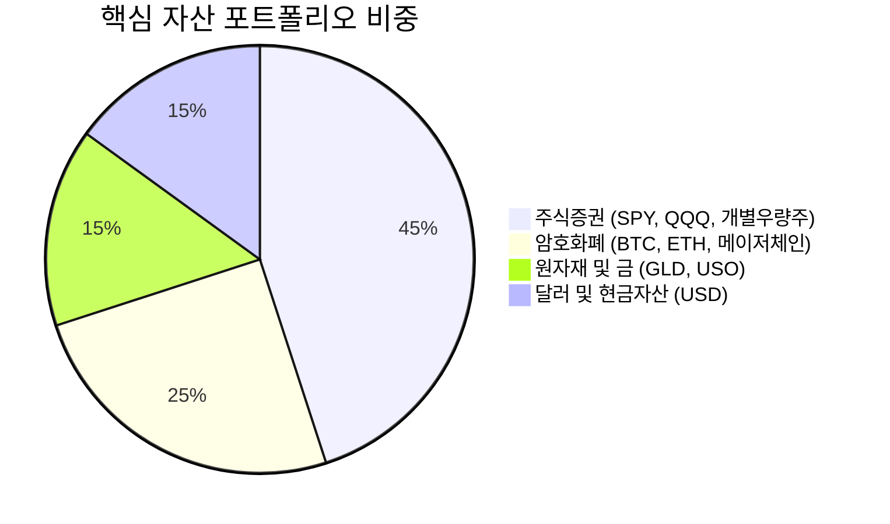
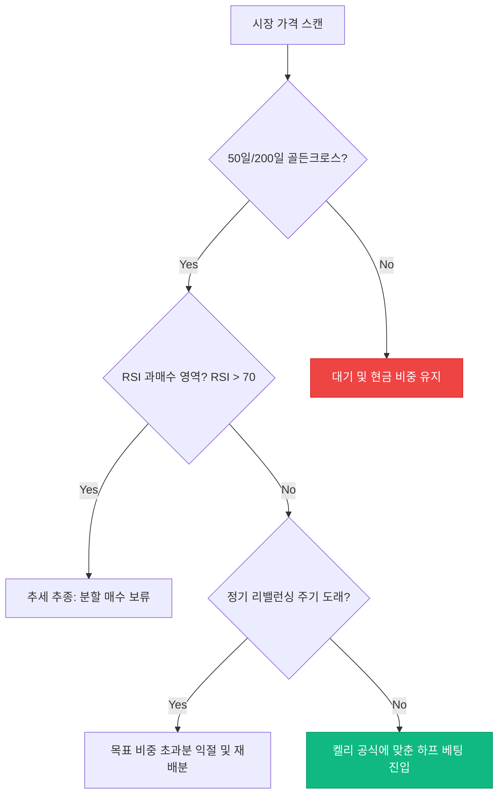

# 📈 퀀트 투자 분석 및 자산 배분 플래너 (Quant Portfolio Planner)

**포트폴리오 기준일:** 2026-06-02
**목표 연수익률 (CAGR):** 15.0% | **최대 허용 낙폭 (MDD):** -15.0%

---

## 📐 1. 자산 배분 수학적 모델 및 켈리 공식 (Kelly Criterion)

최적의 자산 배분 비중과 리스크 대비 베팅 사이즈를 결정하기 위해 **평균-분산 모델** 및 **켈리 공식(Kelly Criterion)**을 적용합니다.

### 켈리 공식에 의한 자산군별 베팅 비율 ($f^*$) 산출:

$$
f^* = \frac{p \cdot b - q}{b} = \frac{p(b + 1) - 1}{b}
$$

*   $f^*$: 전체 투자 자금 중 본 자산군에 투입할 최적의 비율
*   $p$: 투자 성공(상승) 확률 (Win Probability)
*   $q$: 투자 실패(하락) 확률 ($1 - p$)
*   $b$: 손익비 (Payoff Ratio = 평균 수익금 / 평균 손실금)

> [!NOTE]
> 켈리 공식은 기하 기댓값을 최대화하지만, 변동성을 억제하기 위해 실무에서는 **하프 켈리 (Fractional Kelly, $0.5 \cdot f^*$)**를 적용하여 리스크를 보수적으로 제어합니다.

---

## 📊 2. 타겟 포트폴리오 자산 배분 비중

현재 전략에 따른 핵심 자산 비중 구성안입니다.

---

## ⚙️ 3. 트레이딩 알고리즘 및 진입/탈출 의사결정 나무 (Trading Flow)

주요 기술적 지표(이동평균선, RSI) 및 매크로 이벤트에 근거한 매매 실행 알고리즘입니다.

---

## 📝 4. 보유 및 관심 투자 자산 일람 (Asset Ledger)

| 자산 구분 | 티커/심볼 | 현재 비중 (%) | 매수 평단가 | 목표 매도가 | 손절 라인 (Stop-Loss) | 투자 상태 |
| :--- | :---: | :---: | :---: | :---: | :---: | :---: |
| 주식증권 | **QQQ** | 30.0% | $450.00 | $520.00 | $410.00 | 보유 중 |
| 주식증권 | **TSLA** | 15.0% | $180.00 | $260.00 | $160.00 | 보유 중 |
| 암호화폐 | **BTC** | 18.0% | $65,000 | $88,000 | $58,000 | 보유 중 |
| 암호화폐 | **ETH** | 7.0% | $3,200 | $4,500 | $2,800 | 분할 매수 중 |
| 현금/달러 | **USD** | 15.0% | - | - | - | 대기 자금 |

---

## 🔒 5. 리스크 관리 가이드라인 (Macro & Risk Management)

> [!WARNING]
> 암호화폐는 변동성이 매우 크므로 단일 종목에 총 자산의 **10% 이상을 배팅하지 않는 것**을 철칙으로 삼습니다. 매주 일요일 저녁 리밸런싱을 시행하여 급격히 변동한 자산 비중을 복원합니다.

- [x] 주요 미연준(FOMC) 금리 발표 일정 캘린더 등록 완료
- [ ] 미국 CPI/PPI 발표 지표 모니터링
- [ ] 주간 보유 포트폴리오 리밸런싱 매도/매수 주문 실행 완료