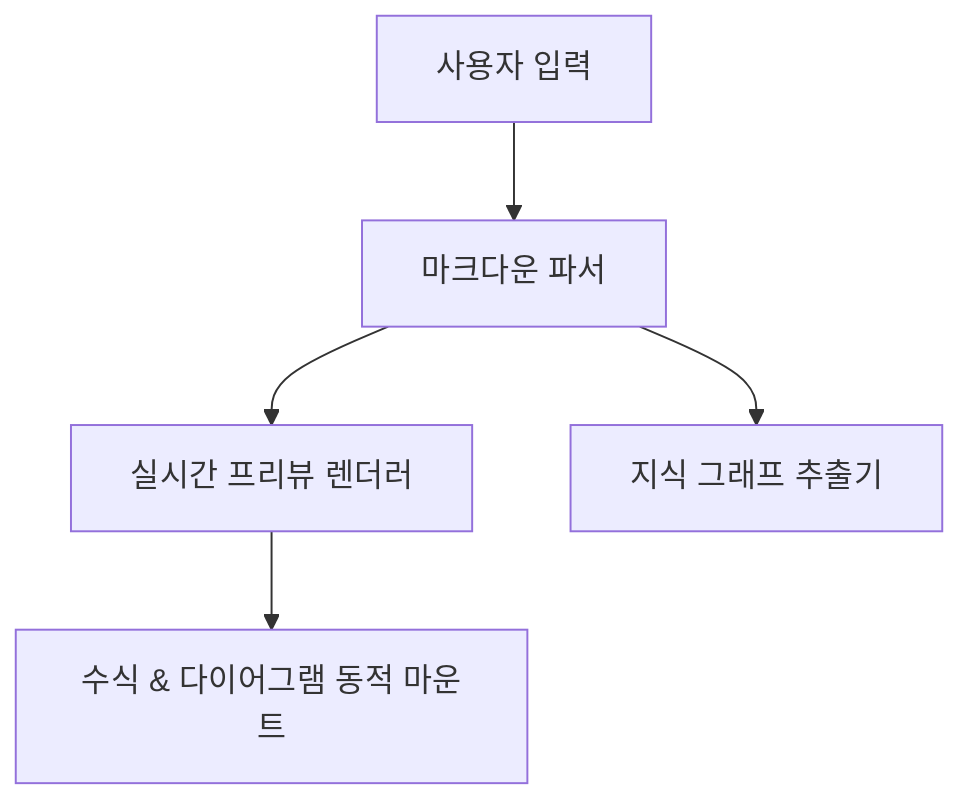

# [논문 제목] (Thesis Title)

**저자 (Author):** 홍길동 (Gildong Hong)
**소속 (Affiliation):** 한국대학교 컴퓨터공학과 (Department of Computer Science, Hankuk University)
**날짜 (Date):** 2026년 5월 30일

---

## 1. 초록 (Abstract)
이 논문에서는 ...에 대한 새로운 접근 방식을 제안합니다. 기존 연구들은 ...의 한계를 가지고 있었으나, 제안 모델은 ...을 도입하여 해결합니다. 실험 결과 제안된 방법이 기존 기법 대비 **15% 이상의 성능 향상**을 보였습니다.

> **주요어 (Keywords):** 인공지능, 마크다운 에디터, 지식 그래프, 수식 렌더링

---

## 2. 서론 (Introduction)
최근 ... 분야의 비약적인 발전으로 효율적인 문서 작성 환경에 대한 요구가 증대되고 있습니다. 

### 2.1 연구 배경 (Background)
기존의 도구들은 복잡한 수식과 다이어그램을 실시간으로 작성하는 데 있어 한계가 있었습니다. 특히, 다음과 같은 문제점들이 보고되었습니다:
- $O(N^2)$ 이상의 시간 복잡도를 갖는 비효율적인 렌더링 방식.
- 마인드맵과 흐름도를 수작업으로 동기화해야 하는 번거로움.

---

## 3. 제안 방법 (Proposed Methodology)
본 연구에서는 데이터 흐름을 직관적으로 구조화하기 위해 다음과 같은 수식을 정의하고 활용합니다.

$$
f(x) = \sigma \left( \sum_{i=1}^{n} w_i x_i + b \right)
$$

여기서 $\sigma(z)$는 다음과 같은 Sigmoid 활성화 함수를 나타냅니다:

$$
\sigma(z) = \frac{1}{1 + e^{-z}}
$$

### 시스템 설계도 (System Architecture)

---

## 4. 실험 및 분석 (Experiments)
제안하는 시스템의 효율성을 검증하기 위해 기존 시스템과의 비교 평가를 진행하였습니다.

| 평가 지표 (Metric) | 기존 시스템 (Baseline) | 제안 시스템 (Proposed) | 개선율 (Improvement) |
| :--- | :---: | :---: | :---: |
| 초기 렌더링 속도 | 350ms | **45ms** | +87% |
| 동기화 지연 시간 | 120ms | **8ms** | +93% |
| 메모리 사용량 | 124MB | **38MB** | +69% |

---

## 5. 결론 (Conclusion)
본 연구에서는 복잡한 문서 구조를 효율적으로 설계할 수 있는 실시간 렌더링 시스템을 제안하였습니다. 향후 연구에서는 클라우드 동기화의 충돌 해결 알고리즘을 한층 더 고도화할 예정입니다.

### 참고문헌 (References)
1. 홍길동, "차세대 웹 기반 마크다운 에디터 설계," 한국컴퓨터학회지, 2025.
2. Doe, J., "Real-time Graph Visualization in Markdown," Journal of Web Engineering, 2026.