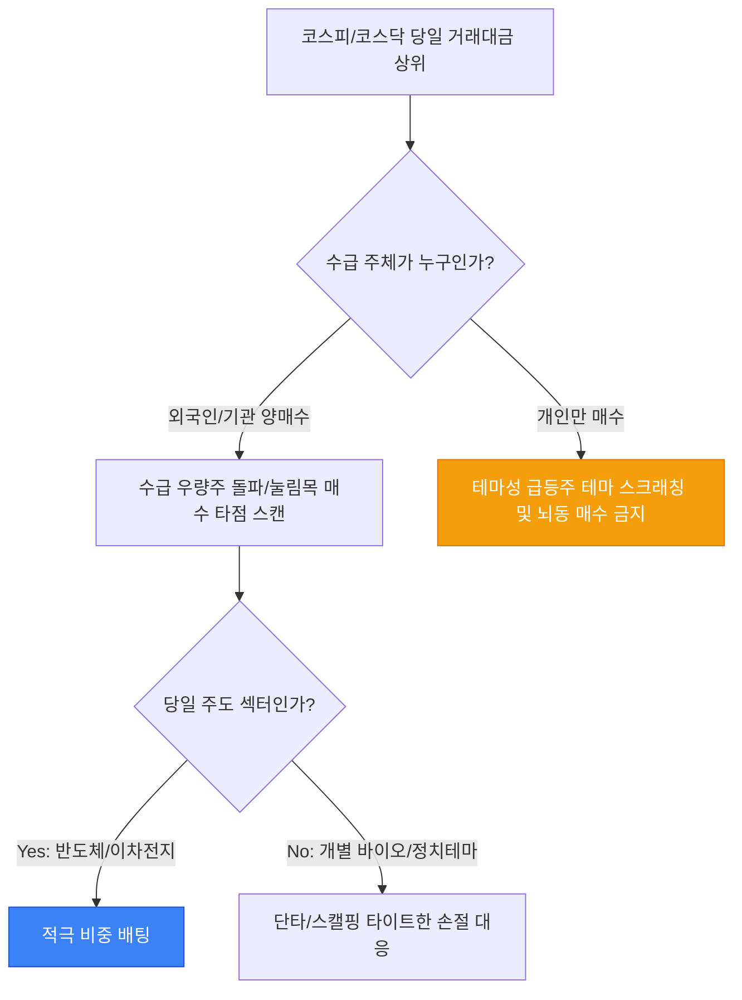

# 🇰🇷 한국주식 매매일지 & 시장 분석 다이어리 (K-Stock Trading Diary)

**매매 일자:** 2026-06-02
**당일 코스피 (KOSPI):** 2,650.50 (▲0.45%) | **코스닥 (KOSDAQ):** 870.20 (▼0.15%)
**원/달러 환율:** 1,350.00원 | **고객예수금:** ₩15,000,000

---

## 📐 1. 세금 및 거래 수수료 차감 후 순수익률 계산 공식 (KaTeX)

국내 주식 거래 시 발생하는 세금(유관기관 수수료, 증권사 수수료, 농어촌특별세 및 거래세)을 정밀하게 반영한 세후 수익률 공식입니다.

### 세후 순수익률 ($R_{net}$) 산출식:

$$
R_{net} = \frac{S_{sell} \cdot (1 - \gamma_{fees} - \gamma_{tax}) - B_{buy} \cdot (1 + \gamma_{fees})}{B_{buy}} \times 100 (%)
$$

*   $B_{buy}$: 총 매수 금액 (매수가 $\times$ 수량)
*   $S_{sell}$: 총 매도 금액 (매도가 $\times$ 수량)
*   $\gamma_{fees}$: 증권사 + 유관기관 수수료율 (예: $0.015\% \rightarrow 0.00015$)
*   $\gamma_{tax}$: 증권거래세 + 농어촌특별세율 (코스피 $0.15\%$, 코스닥 $0.15\% \rightarrow 0.0015$)

---

## ⚙️ 2. 당일 주도 섹터 및 외국인/기관 수급 분석 (Mermaid)

그날의 시장 에너지를 분석하여 강세 테마와 주요 수급 주체의 방향성을 기록합니다.

---

## 📝 3. 당일 매매 일지 및 거래 내역 (Trading Ledger)

| 종목명 (티커) | 시장 구분 | 매매 구분 | 체결 수량 | 평단가 (원) | 실구매액 (원) | 당일 거래대금 | 주도 테마/매매 근거 |
| :--- | :---: | :---: | :---: | :---: | :---: | :---: | :--- |
| **삼성전자** (005930) | KOSPI | 매수 | 100주 | 78,500원 | 7,850,000원 | 8,500억 | 반도체 HBM 공급망 통과 뉴스 수급 유입 |
| **알테오젠** (196170) | KOSDAQ | 매도 | 20주 | 210,000원 | 4,200,000원 | 4,200억 | 바이오 낙폭과대 반등 구간 분할 익절 완료 |
| **에코프로** (086520) | KOSDAQ | 관망 | - | - | - | 1,800억 | 이차전지 지지선 테스트 중, 매수 보류 |

---

## 🧠 4. 뇌동매매 방지 오답노트 & 자아성찰 (Trading Review)

> [!CAUTION]
> 장 시작 후 **초반 30분(09:00 ~ 09:30) 이외의 급등주 추격 매수**는 무조건 손실로 이어진다는 것을 명심합니다. 손절라인(-3%) 도달 시 예외 없이 시장가 기계적 대응을 원칙으로 삼습니다.

- [x] 원칙 매매 준수 여부: **90점 (뇌동 매수 없음, 손절 원칙 준수)**
- [ ] 당일 손실 발생 종목의 차트 캡처 및 지지선 붕괴 원인 분석
- [ ] 다음 날 장전 미 증시(나스닥/필라델피아 반도체지수) 마감 브리핑 확인 예약

---

## 📅 5. 공모주(IPO) 및 주요 경제 일정 캘린더

- [x] OO솔루션 공모 청약 신청 완료 (청약금 환불일: 6/4)
- [ ] 금요일 금융통화위원회 기준금리 결정 발표 모니터링