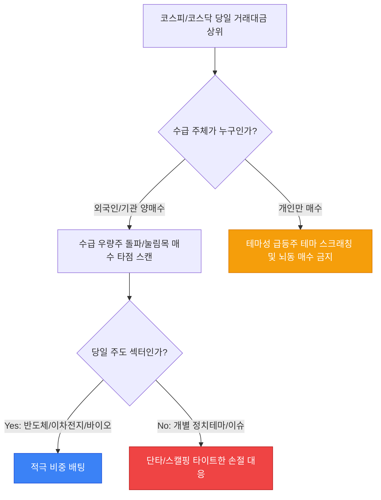

# 🇰🇷 한국주식 매매일지 & 시장 분석 다이어리 (K-Stock Trading Diary)

> **💡 매매일지 작성 팁**: 매일 장 마감 후 당일의 시장 주도 테마와 나의 매매 원칙을 기록하여 뇌동매매를 방지하고 누적 수익을 극대화하세요.

### 📅 기본 정보 기록
*   **매매 일자:** 2026-06-03
*   **당일 지수:** KOSPI `2,650.50 (▲0.45%)` | KOSDAQ `870.20 (▼0.15%)`
*   **고객예수금:** ₩15,000,000 | **당일 환율:** 1,350.00원

---

## 📐 1. 세금 및 거래 수수료 차감 후 순수익률 계산 공식 (KaTeX)

국내 주식 거래 시 발생하는 세금(유관기관 수수료, 증권사 수수료, 농어촌특별세 및 거래세)을 정밀하게 반영한 세후 수익률 공식입니다.

### 🧮 세후 순수익률 ($R_{net}$) 산출식:

$$
R_{net} = \frac{S_{sell} \cdot (1 - \gamma_{fees} - \gamma_{tax}) - B_{buy} \cdot (1 + \gamma_{fees})}{B_{buy}} \times 100 (%)
$$

*   $B_{buy}$: **총 매수 금액** (매수가 $\times$ 수량)
*   $S_{sell}$: **총 매도 금액** (매도가 $\times$ 수량)
*   $\gamma_{fees}$: **증권사 + 유관기관 수수료율** (예: 토스증권 국내주식 수수료 $0.015\% \rightarrow 0.00015$)
*   $\gamma_{tax}$: **증권거래세 + 농어촌특별세율** (코스피/코스닥 공통 $0.15\% \rightarrow 0.0015$)

---

## ⚙️ 2. 당일 주도 섹터 및 외국인/기관 수급 분석 (Mermaid)

그날의 시장 에너지를 분석하여 강세 테마와 주요 수급 주체의 방향성을 기록합니다.

---

## 📝 3. 당일 매매 일지 및 거래 내역 (Trading Ledger)

| 종목명 (티커) | 시장 | 매매 구분 | 체결 수량 | 평단가 (원) | 실매매금액 (원) | 손익률 / 손익금 | 주도 테마 / 매매 근거 및 반성 |
| :--- | :---: | :---: | :---: | :---: | :---: | :---: | :--- |
| **삼성전자** (005930) | KOSPI | 매수 | 100주 | 78,500원 | 7,850,000원 | `-` | 반도체 HBM 공급망 통과 뉴스 수급 유입으로 1차 진입 |
| **알테오젠** (196170) | KOSDAQ | 매도 | 20주 | 210,000원 | 4,200,000원 | `+4.2% / +17만` | 바이오 낙폭과대 반등 구간 분할 익절 완료 |
| **현대차** (005380) | KOSPI | 손절 | 10주 | 250,000원 | 2,500,000원 | `-3.1% / -8만` | 지지선 이탈에 따른 원칙적인 칼손절 기계적 대응 |

---

## 🧠 4. 뇌동매매 방지 오답노트 & 자아성찰 (Trading Review)

> [!CAUTION]
> 장 시작 후 **초반 30분(09:00 ~ 09:30) 이외의 급등주 추격 매수**는 무조건 손실로 이어진다는 것을 명심합니다. 손절라인(-3%) 도달 시 예외 없이 시장가 기계적 대응을 원칙으로 삼습니다.

### 🚨 당일 원칙 매매 평가
*   **원칙 매매 준수 점수:** `90점` (뇌동 매수 없음, 손절 원칙 철저)
*   **오늘의 오답 노트:**
    *   현대차 매매 시 지지선 이탈 시점(243,000원)에서 약간의 미련을 가졌으나, 다행히 매뉴얼대로 기계적인 시장가 손절을 단행하여 추가 하락폭(-5.5%대까지 추락)을 안전하게 방어함.
    *   오전 10시 이후 시장이 지루해질 때 뇌동매매 충동이 왔으나 에디터 창을 닫고 산책을 다녀온 것은 훌륭한 선택이었음.

### 🎯 다음 영업일 매매 전략 예약
- [ ] 내일 장전 미 증시(나스닥/필라델피아 반도체지수) 마감 브리핑 확인
- [ ] 오늘 거래대금 3,000억 이상 주도 섹터(반도체 유리기판) 대장주 스크리닝
- [ ] 관심 종목군 지지/저항 라인 차트 작도 업데이트 및 시나리오 수립

---

## 📅 5. 공모주(IPO) 및 주요 경제 일정 캘린더

- [x] OO솔루션 공모 청약 신청 완료 (청약금 환불일: 6/4)
- [ ] 미국 FOMC 기준금리 발표 라이브 모니터링 (6/12)
- [ ] 금요일 한국은행 금융통화위원회 기준금리 결정 브리핑 체크